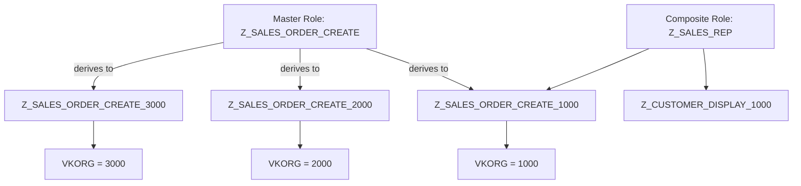

## 1. Beginner Concepts

Every SAP system enforces access through a single, non-negotiable mechanism: the **AUTHORITY-CHECK** statement embedded directly in ABAP code. This is the single most important fact to internalize before anything else in SAP Security makes sense - **authorization is not a layer bolted on top of the application, it is woven into the application logic itself.**

When a developer writes a transaction like `VA01` (Create Sales Order), the program contains lines similar to:

```abap
AUTHORITY-CHECK OBJECT 'V_VBAK_VKO'
  ID 'VKORG' FIELD vbak-vkorg
  ID 'ACTVT' FIELD '01'.

IF sy-subrc <> 0.
  MESSAGE e042(v1) WITH vbak-vkorg.
ENDIF.
```

If the check fails, `sy-subrc` is non-zero and the program raises an error - the user sees "No authorization" style messages. The **role** is nothing more than a container that, once assigned to a user, populates the user's authorization buffer with the field values (like `VKORG = 1000`, `ACTVT = 01/02/03`) that make these checks pass.

**Key beginner vocabulary:**

- **Authorization Object**: A template of up to 10 fields (e.g., `VKORG`, `ACTVT`) that groups related checks (e.g., `V_VBAK_VKO` controls sales order access by sales organization).
- **Authorization Field**: A single field within an object (e.g., `ACTVT` = Activity: 01-Create, 02-Change, 03-Display).
- **Authorization**: A concrete instance of an object with specific values filled in (e.g., `VKORG = 1000`, `ACTVT = 01`).
- **Role**: A collection of transactions (menu) plus the authorizations generated for the authorization objects proposed for those transactions.
- **Profile**: The technical, generated container of authorizations that actually gets loaded into the user buffer. Roles generate profiles; profiles are what SAP historically checked before roles existed (S_USER_PRO concept still exists for manual profile assignment, though PFCG-generated profiles dominate modern landscapes).

## 2. Intermediate Concepts

### The SU24 Proposal Mechanism

Here is where most "I know PFCG" consultants stop being useful in an architect interview. **SU24 does not enforce anything.** It is purely a *maintenance-time convenience table* (`USOBX_C` and `USOBT_C`) that tells PFCG which authorization objects to propose, and with what default values, when a transaction code is added to a role's menu.

The flow works like this:

1. A developer writes `AUTHORITY-CHECK` for object `M_MSEG_WMB` inside transaction `MIGO`.
2. Someone (usually Basis or Security team via SU24, or SAP itself for standard transactions) maintains the **check indicator** for `MIGO` + `M_MSEG_WMB` as one of: **Check/Maintain** (Yes, propose it), **Check** (enforce but don't propose in PFCG), **No Check** (disable the AUTHORITY-CHECK entirely for this transaction - dangerous), or **Unmaintained** (the object is checked but SU24 has no entry, meaning it silently does NOT get proposed - a very common source of missing authorizations after upgrades).
3. When you add `MIGO` to a role menu in PFCG, PFCG reads `USOBX_C`/`USOBT_C`, pulls in every object marked "Check/Maintain", and pre-fills the values from the SU24 default (if maintained) into the role's authorization tab.
4. The security consultant then narrows those proposed values (e.g., restricting `WERKS` to specific plants) before generating the profile.

### Why This Matters

If an object is set to **"No Check"** in SU24, the `AUTHORITY-CHECK` in the code still technically fires, but the kernel treats it as always passing (`sy-subrc = 0` unconditionally) for that specific check indicator setting - **this is a common audit finding**: someone disabled a check organization-wide to "fix" an authorization issue quickly, inadvertently removing a control for every user, not just the one who complained.

## 3. Advanced Concepts

### Composite, Single, and Derived Roles

- **Single Role**: One role = one authorization concept unit, typically mapped to a job function slice (e.g., "Sales Order Display - Plant 1000").
- **Composite Role**: A container of single roles, used purely for **assignment convenience** to users - it generates no authorization data of its own. Composite roles are how you build a "job" (e.g., "Sales Representative" composite = Sales Order Display + Sales Order Create + Customer Master Display single roles).
- **Derived Role**: A child role that inherits the **menu and authorization values** from a master role for every field **except organizational level fields** (like `VKORG`, `WERKS`, `BUKRS`), which are re-entered per derived role. This is the backbone of scalable role design in any multi-org-unit landscape: you maintain the menu and non-org authorizations once in the master, and only maintain org values in each derived child.



### SU25: The Upgrade Migration Engine

`SU25` exists to reconcile SU24 data when SAP ships new authorization defaults with a support pack or upgrade. Its steps (1A through 2D historically, consolidated in S/4HANA) manage:

- **Step 1**: Initial fill of `USOBX_C`/`USOBT_C` from SAP's shipped `USOBX`/`USOBT` (only relevant on very first activation).
- **Step 2A**: Compare SAP's new defaults against your customer tables and flag new/changed check indicators.
- **Step 2B**: Show roles affected by the changes.
- **Step 2C**: Show new transaction codes added to the system that might need role assignment.
- **Step 2D**: Compare and adjust for customer transaction codes.

**Architect-level insight**: skipping SU25 after an upgrade is one of the most common root causes of "everything broke after the upgrade" tickets - roles silently miss newly-required authorization objects because SU24 defaults were never merged, or, conversely, a previously "No Check" object flips to "Check/Maintain" and suddenly authorizations users never had start being enforced.

## 4. Architect Level Concepts

At the architect level, role design is a **governance and scalability problem**, not a transactional one. Key decision points you must be able to defend in an interview:

- **Role naming convention** must encode: layer (single/composite/derived), business function, and org scope - e.g., `Z_SD_ORD_CRE_D_1000` (Sales & Distribution, Order Create, Derived, Plant 1000).
- **Org-level field strategy**: decide up front which fields are "org level" for your enterprise role concept (standard SAP org fields plus any custom fields you promote to org-level via `SU24`/`PFCG` org level maintenance). Getting this wrong means thousands of single roles instead of clean derivation trees.
- **Enabler vs. business roles**: separate technical/enabler roles (e.g., print, background job, cross-application display) from business-process roles, and combine them at the composite layer - this avoids duplicating enabler authorizations across every business role.
- **Role build strategy**: Top-down (start from business process/job architecture, design roles, then map to transactions) vs. Bottom-up (start from existing usage/trace data, common post go-live cleanup) vs. Hybrid (used in 90% of real S/4HANA migration programs).

## 5. Internal Working

When a user executes a transaction, the kernel-level dispatcher performs these steps, in order:

1. **Transaction Start Authorization Check** - object `S_TCODE` is checked implicitly by the kernel for every transaction start (this is *not* a developer-written check; it is automatic).
2. **SAP_ALL / Profile Buffer Lookup** - the user's authorization buffer (built at logon from `USR04`, `UST04`, `UST10S`, and profile parameter `auth/number_of_trace_entries` if trace is active) is loaded into shared memory for fast repeated checks.
3. **Application AUTHORITY-CHECK statements execute** in the program flow as coded, each one independently evaluating against the buffer.
4. **Buffer aging**: authorization buffer changes (new role assignment) require either a **user re-login** or, in modern systems, is picked up faster via `SU56` buffer reset or automatic buffer synchronization jobs - a very common "I assigned the role but it still doesn't work" support scenario.

## 6. Real Production Examples

**Case**: A Fortune 500 manufacturing client rolled out a new derived role for a shared-service finance team spanning 12 company codes. Two weeks post go-live, users in only 3 of the 12 company codes reported missing access to a new custom transaction, `ZFI_INVOICE_RELEASE`.

Root cause: the custom transaction had never been maintained in `SU24` (it was pure custom Z-code with a direct `AUTHORITY-CHECK OBJECT 'Z_FI_REL'`), so it was **Unmaintained**. When it was added to the derived master role's menu, PFCG proposed nothing, and the consultant manually added `Z_FI_REL` to the master - but manually-added objects **do not automatically propagate into already-generated derived roles' org-value inheritance** unless "Adjust Derived Roles" is explicitly run in the master. The 9 company codes that were fine had been regenerated after a later transport; the 3 broken ones were stale.

**Best Practice derived**: always run `PFCG` mass-generation with "Adjust Derived Roles" checked after modifying a master role, and maintain custom Z-transactions in `SU24` as a mandatory step of the development transport checklist - never let custom code ship without an SU24 proposal entry.

## 7. SAP Notes (Reference Only)

- SAP Note covering SU25 step consolidation for S/4HANA releases (check your specific release's SU25 documentation in the system).
- SAP Note on authorization default value (SU24) mass maintenance transaction SU24 vs SU22 (SAP-delivered vs customer namespace).
- SAP Note on PFCG mass comparison / mass generation performance for large role landscapes (batch mode recommendations).

*(Always verify exact SAP Note numbers against your current support package level via the SAP Support Portal - they are release-dependent and should never be memorized as static facts for production use.)*

## 8. Best Practices

- Never assign `SAP_ALL` or `SAP_NEW` in any system above a personal sandbox - not even "temporarily."
- Maintain custom transactions in SU24 as part of the standard transport-to-production checklist.
- Use derived roles for every org-level variation; avoid copying single roles to create org variants.
- Run regular `SUIM` reports (`S_BCE_68001418` - roles by complex selection criteria) to catch role sprawl.
- Document org-level field decisions in an Architecture Decision Record (ADR) - this single document saves months of rework during S/4HANA migration role redesign.

## 9. Common Mistakes

- Disabling an authorization check ("No Check" in SU24) to silence one user's error, breaking least-privilege for everyone.
- Forgetting "Adjust Derived Roles" after master role changes.
- Treating composite roles as if they carry authorization data (they don't - always trace back to the single/derived role).
- Not re-running SU25 after upgrades, leaving new SAP-delivered authorization objects unchecked or unassigned.
- Copying a single role to "quickly" create a variant instead of deriving - creates long-term maintenance debt.

## 10. Interview Questions

- "Walk me through what happens, step by step, from a user reporting 'no authorization' on VA01 to you closing the ticket."
- "What is the actual difference between what SU24 controls and what AUTHORITY-CHECK enforces?"
- "How would you redesign a role concept that has 4,000 single roles with 80% duplicate authorization data across company codes?"
- "A support pack changed a check indicator from 'No Check' to 'Check/Maintain' for a widely-used object. How do you assess impact before transporting?"

## 11. Hands-on Lab

**Objective**: Trace, diagnose, and fix a missing authorization end-to-end.

**Prerequisites**: Access to SU53, ST01/STAUTHTRACE, PFCG, and a test user without full access.

**Exercise**:
1. Log on as the test user, attempt `VA01`, and let it fail.
2. Immediately run `SU53` as that user (or have security run it via `SU53` with the user's name in a supported release) to see the last failed check.
3. Cross-reference the failing object against the role's authorization tab in `PFCG` for the assigned role.
4. Determine if the fix is: (a) a genuine missing value in an existing role, (b) a missing SU24 proposal requiring a new object entirely, or (c) a stale buffer requiring `SU56`/re-login.

**Expected Output**: A documented root-cause classification and a before/after authorization trace showing `sy-subrc = 0` after the fix.

**Cleanup**: Revert any test role changes; do not leave broadened test authorizations in non-sandbox systems.

## 12. Troubleshooting

| Symptom | Likely Cause | Diagnostic Tool |
|---|---|---|
| "No authorization" despite role assignment | Buffer not refreshed | SU56, re-login |
| Works for some org units, not others | Derived role not adjusted/regenerated | PFCG mass generation log |
| New Z-transaction has zero proposed objects | Missing SU24 entry | SU24 |
| Worked before upgrade, broken after | SU25 not run / new check indicator | SU25, SPAU/SPDD adjacent checks |

## 13. Audit Perspective

Auditors specifically test for: (1) any active `SAP_ALL`/`SAP_NEW` assignment in production, (2) authorization objects set to "No Check" system-wide without a documented, approved business justification, (3) evidence that SU25 was executed and reviewed after each upgrade (change record), and (4) segregation of duties conflicts introduced by composite role combinations - which is why GRC risk analysis must run **before** composite role assignment, not just at single-role design time.

## 14. Performance Impact

Deeply nested derived-role hierarchies with excessive composite role membership increase logon buffer build time and `PFCG` mass-generation runtime. For landscapes with 10,000+ users, schedule mass role comparison/generation as background jobs during low-usage windows, and monitor `SU53`/`STAUTHTRACE` volume - leaving `STAUTHTRACE` enabled system-wide in production is a performance and disk-space risk, not just a security trace tool.

## 15. Security Risks

- Over-provisioned org-level ranges (`WERKS = *`) defeat the purpose of derivation entirely.
- SU24 "No Check" settings applied broadly create silent, undocumented control gaps that persist for years.
- Composite roles combining incompatible business functions create SoD violations invisible at the single-role level.

## 16. Architecture

Enterprise role architecture should be modeled in four layers: **Master Roles** (menu + non-org authorizations) → **Derived Roles** (org values) → **Composite Roles** (job-function bundling) → **User Assignment** (via PFCG or, more commonly at scale, GRC Access Request Management with automated provisioning workflows).

## 17. Decision Making

When asked "single role vs. derived role" in an interview, the correct framework is: **derive whenever the same menu/non-org authorization set must exist across more than one organizational value.** If a role is genuinely org-unit-specific with no reuse potential, a single role may be acceptable, but always default to evaluating derivation first - it is the scalable pattern.

## 18. FAQs

**Q: Does deleting a transaction from a role's menu remove its authorization objects automatically?**
A: No. PFCG marks the objects as "maintained manually" once you've touched them, and they persist until you explicitly remove them from the authorization tab, even if the transaction is removed from the menu.

**Q: Can two different transactions share the same authorization object check?**
A: Yes, extensively - e.g., `M_MSEG_WMB` is checked across multiple MM movement-type transactions. This is exactly why SU24 exists as a central proposal table rather than per-transaction hardcoding.
