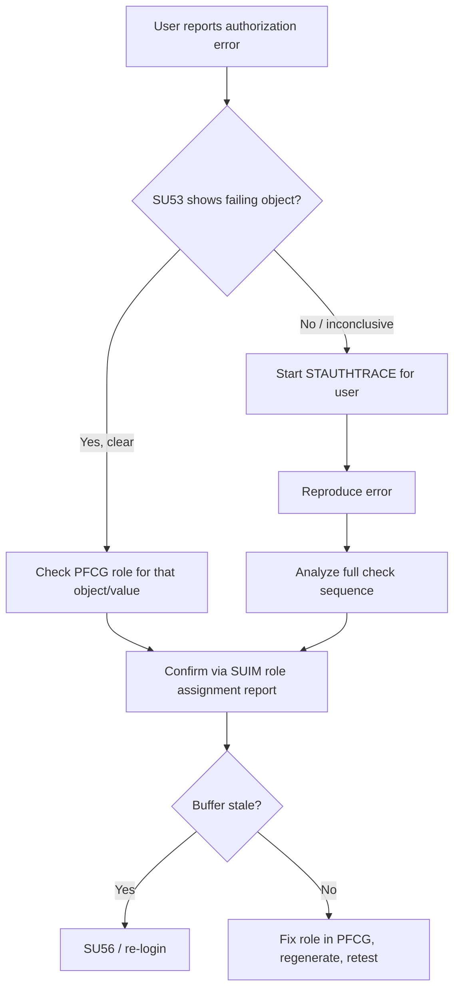

## 1. Beginner Concepts

Authorization troubleshooting always starts from one question: **what was the last (or only) authorization object that failed?** `SU53` answers this by displaying the most recent failed `AUTHORITY-CHECK` for the currently logged-on user (or, in newer releases, any user you have display authority for). It is fast, requires zero setup, and should always be the first tool reached for.

## 2. Intermediate Concepts

`SU53`'s core limitation is that it only shows the **last** failed check, not the full sequence - if a transaction performs five authorization checks and the first one fails, you'll never see checks two through five in SU53's output, even if they'd also fail. This is where trace tools become necessary.

`STAUTHTRACE` (the modern, scalable authorization trace) records **every** authorization check - pass or fail - for a specified user over a trace window, without the broader (and heavier) overhead of the older `ST01` system trace, which captures authorization checks alongside DB, RFC, and other trace categories simultaneously.

## 3. Advanced Concepts

Reading a trace correctly means distinguishing **check failures from check absences**: a trace showing zero entries for an expected authorization object often means the object was never checked at all in that code path (a different logic branch executed), not that authorization was silently granted. Conversely, `sy-subrc <> 0` in a trace entry is an explicit failure with the exact field values that didn't match.

`SUIM` (User Information System) is not a trace tool at all - it's a reporting layer over current role/profile/authorization assignment data (`S_BCE_68001*` report family). It answers "who currently has access to X," not "what happened during this specific transaction execution." Confusing the two is one of the most common mistakes junior consultants make in interviews.

## 4. Architect Level Concepts

At the architect level, you're expected to design a **troubleshooting runbook**, not just know individual tools: (1) reproduce with SU53 first for speed, (2) escalate to STAUTHTRACE if SU53 is inconclusive or multiple objects are suspected, (3) cross-reference SUIM to confirm the user's actual current role/profile assignment matches expectations, (4) check for buffer staleness (SU56) before concluding it's a genuine role gap, (5) only then modify the role via PFCG.

## 5. Internal Working

Every `AUTHORITY-CHECK` statement, when it fails, writes an entry to the kernel's authorization check log used by SU53 (a rolling buffer per user session) and, if active, to the STAUTHTRACE/ST01 trace file. The kernel does not distinguish "important" from "unimportant" checks - all are logged identically, which is why trace files can grow large quickly and should never be left running indefinitely in production.

## 6. Real Production Examples

A support consultant spent two days convinced a user's role was missing an authorization object because SU53 kept showing a clean "no failure" result - the actual problem was a custom BAdI implementation performing its own authorization check via a completely different, undocumented custom authorization object that had never been added to SU24 and therefore wasn't obviously connected to the transaction in anyone's mental model. Only a full STAUTHTRACE session (which captures every check, documented or not) revealed the custom object being checked and failing. Lesson: when SU53 looks clean but the user still can't complete the action, always escalate to a full trace rather than assuming the problem is elsewhere (e.g., data issue) - the check may be happening in code paths SU53 doesn't surface conveniently.

## 7. SAP Notes (Reference Only)

Check SAP Notes for STAUTHTRACE availability and behavior differences across releases, and for SU53's known limitations/enhancements in specific support packages.

## 8. Best Practices

- Always attempt to reproduce the issue immediately after the user reports it - authorization buffers and traces are time-sensitive.
- Never leave STAUTHTRACE/ST01 running indefinitely in production; scope trace windows tightly.
- Document custom authorization objects thoroughly precisely because they're invisible to standard SU24-driven tooling assumptions.

## 9. Common Mistakes

- Treating SUIM as a real-time trace tool.
- Stopping investigation after a clean SU53 result without considering custom/undocumented checks.
- Leaving system-wide traces running long enough to cause performance or disk space issues.

## 10. Interview Questions

- "SU53 shows nothing failing, but the user still can't complete the transaction. What's your next step?"
- "What's the actual difference between ST01 and STAUTHTRACE, and when would you pick one over the other?"
- "How would you find every authorization object checked during a specific complex transaction, including custom code?"

## 11. Hands-on Lab

Trigger a deliberate authorization failure, capture it with SU53, then start a STAUTHTRACE session, reproduce the same failure, and compare the two tools' output side by side to internalize the difference in depth and scope.

## 12. Troubleshooting

| Symptom | Cause | Tool |
|---|---|---|
| SU53 shows nothing, error persists | Check likely in custom/undocumented code path | STAUTHTRACE full trace |
| Trace file growing very large | Trace left running too broadly/long | STAUTHTRACE administration, cleanup job |
| SUIM shows correct role, error still occurs | Buffer stale or check happening elsewhere | SU56, STAUTHTRACE |

## 13. Audit Perspective

Auditors occasionally request evidence that authorization trace tools are access-controlled themselves (viewing another user's trace/authorization data is sensitive) - ensure SU53/STAUTHTRACE display-for-other-users capability is itself tightly restricted and logged.

## 14. Performance Impact

STAUTHTRACE is lighter than full ST01 system tracing but still adds overhead; always scope to a specific user and time window rather than tracing system-wide.

## 15. Security Risks

Broad, standing authority to view any user's SU53/trace data is itself a privileged capability - restrict and monitor who holds it.

## 16. Architecture

Position trace tooling as the diagnostic layer sitting between "user reports an issue" and "security team modifies a role" - never skip straight to role modification without trace-based root cause confirmation, or you risk over-provisioning to make symptoms disappear without understanding them.

## 17. Decision Making

Choose STAUTHTRACE over classic ST01 by default for any authorization-specific investigation in modern releases - reserve ST01 for cases where you specifically need authorization checks correlated with other trace categories (DB calls, RFC calls) in a single unified timeline.

## 18. FAQs

**Q: Can SU53 show a different user's last failed check?**
A: In many releases yes, if you hold the necessary display authority and the user recently had a failure in an active session - but it's still limited to the single most recent failure, same constraint as viewing your own.
