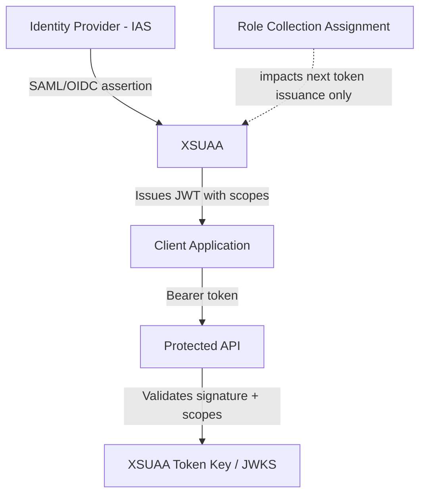

## 1. Beginner Concepts

SAP BTP applications do not use PFCG or `AUTHORITY-CHECK`. Instead, authorization is token-based: a user authenticates (typically via IAS or a custom identity provider), receives a **JWT (JSON Web Token)** containing their granted **scopes**, and every API call presents that token for validation by **XSUAA** (the eXtension User Account and Authentication service) or, in Cloud Foundry-native/Kyma contexts, an equivalent OAuth-based authorization layer.

## 2. Intermediate Concepts

The BTP authorization hierarchy has four layers: **Scopes** (defined by the developer in `xs-security.json`, the finest-grained permission unit), **Role Templates** (shipped with the application, group scopes into meaningful roles), **Roles** (administrator-instantiated, can add attribute restrictions), and **Role Collections** (administrator-created bundles of roles, possibly spanning multiple applications, actually assigned to end users).

## 3. Advanced Concepts

**Subaccounts** are BTP's tenant-isolation boundary - each subaccount has its own XSUAA instance, its own trust configuration to an identity provider, and its own set of role collections. A single global account can span many subaccounts (e.g., dev/test/prod, or per-region), and a common architect-level mistake is assuming role collections or trust configuration automatically propagate between subaccounts - they do not; each is independently configured unless explicitly automated via CI/CD or the BTP CLI/APIs.

**Attribute-based restrictions** on roles (e.g., restricting a role to a specific cost center value passed as a SAML/OIDC attribute) enable a form of row-level security at the application layer, conceptually similar to derived-role org values in classic ABAP but implemented entirely differently - the restriction lives in the role definition and is validated by the application itself reading token attributes, not by a central kernel-enforced mechanism.

## 4. Architect Level Concepts

Token lifecycle is the single most misunderstood architecture point: once a JWT is issued, it is valid for its lifetime (typically short, often ~30-60 minutes, refreshed transparently by the client) **regardless of role collection changes made after issuance**. Revoking a role collection from a user does not invalidate already-issued tokens still within their validity window - this has real incident-response implications (a compromised or terminated user's access doesn't vanish instantly, unlike a classic ABAP buffer reset).

## 5. Internal Working

XSUAA validates incoming JWTs by checking the signature against its published JSON Web Key Set (JWKS), verifying the token hasn't expired, and extracting the `scope` claim to compare against what the calling API endpoint requires (enforced by the application's own middleware, typically via the `@sap/xssec` or Java Spring Security integration libraries, not a central "kernel" the way ABAP has one).

## 6. Real Production Examples

A financial services client had an urgent security incident: a contractor's access needed to be revoked immediately after an early contract termination. The security team removed the role collection in BTP Cockpit and reported the incident closed - but 40 minutes later, the contractor was still able to call APIs using a token issued just before revocation, because the token remained valid for its full lifetime. The client's incident response runbook was updated to explicitly include, for any urgent BTP access revocation, an additional step: disable the user at the identity provider (IAS) level, which prevents new token issuance and refresh, not just remove the role collection - and for true immediate termination needs, force sign-out / token revocation at the IAS session level where supported.

## 7. SAP Notes (Reference Only)

Review current SAP Help/Notes documentation for XSUAA token lifetime defaults and configuration options, and for role collection propagation behavior across subaccounts in your specific BTP landscape/region.

## 8. Best Practices

- Design scopes at the finest meaningful granularity in `xs-security.json`; avoid one giant "admin" scope covering unrelated functions.
- Treat identity-provider-level user disablement, not just role collection removal, as the authoritative "revoke access now" action.
- Automate role collection and trust configuration propagation across subaccounts via CI/CD rather than manual per-subaccount clicks.

## 9. Common Mistakes

- Assuming role collection changes take effect immediately for already-issued tokens.
- Manually replicating role collections/trust config per subaccount without automation, causing drift between dev/test/prod.
- Designing overly broad scopes that make least-privilege role design impossible downstream.

## 10. Interview Questions

- "A user's role collection was removed 10 minutes ago but they can still call the API. Why, and what would you do differently for an urgent revocation?"
- "Explain the four-layer BTP authorization hierarchy and map it to the ABAP concepts an experienced consultant already knows."
- "How would you design multi-subaccount governance so security configuration doesn't drift between environments?"

## 11. Hands-on Lab

In a BTP trial or sandbox subaccount, define a scope and role template in `xs-security.json`, deploy, create a role and role collection, assign to a test user, then remove the role collection and observe (using a previously issued, still-valid token) that access persists until token expiry.

## 12. Troubleshooting

| Symptom | Cause | Tool |
|---|---|---|
| Access persists after role collection removal | Token still valid (not yet expired) | BTP Cockpit, application logs, token expiry inspection |
| Role collection missing in target subaccount | No automated propagation | BTP CLI/APIs, CI/CD pipeline review |
| 403 despite correct role collection | Scope name mismatch between `xs-security.json` and application check | Application logs, `xs-security.json` review |

## 13. Audit Perspective

Auditors increasingly test BTP-specific controls: subaccount-level access review evidence, role collection assignment review cadence, and explicit confirmation that "urgent revocation" procedures address token lifetime, not just role collection removal.

## 14. Performance Impact

Excessive scope/role granularity fragmentation can complicate token size and role administration overhead at very large scale; balance granularity against manageability.

## 15. Security Risks

Overly long token lifetimes increase the exposure window after a revocation event; align token lifetime configuration with your organization's acceptable risk window for access revocation latency.

## 16. Architecture

BTP security architecture is federated and token-based end-to-end: Identity Provider → XSUAA → Application, with subaccounts as the tenant/trust isolation boundary - fundamentally different from ABAP's single-system buffer model, and this difference must be explained clearly to stakeholders used to ECC-style "instant" access changes.

## 17. Decision Making

When deciding token lifetime configuration, balance user experience (frequent re-authentication is disruptive) against security posture (shorter lifetimes reduce post-revocation exposure) - most enterprise landscapes land on short access-token lifetimes with silent refresh-token-based renewal, revocable at the refresh-token/session level.

## 18. FAQs

**Q: Is XSUAA the same thing as an identity provider?**
A: No - XSUAA is an authorization server (OAuth), not an identity provider. It trusts an upstream identity provider (commonly IAS) for authentication, then issues its own scoped tokens for authorization.
