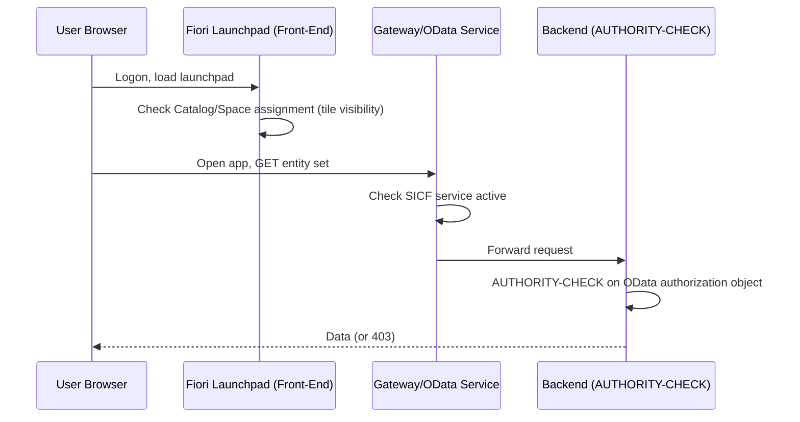

## 1. Beginner Concepts

A Fiori app's visibility and function depend on **two independent role assignments** that beginners frequently conflate: a **front-end (Launchpad) role** granting the *tile/catalog* so the app appears on the launchpad, and a **back-end (OData/authorization) role** granting the actual data access the app needs once opened. A user can have one without the other - the app tile shows but the app errors on open, or the app never appears even though the user technically has full backend data access.

## 2. Intermediate Concepts

**Catalogs** group Fiori apps (tiles/target mappings); **Groups** (classic) or **Spaces and Pages** (modern launchpad) control how those catalogs are visually organized for the end user. Catalogs are assigned via PFCG role menu (as "Fiori catalog" menu entries) exactly like transaction codes are assigned in classic roles - this is the same PFCG mechanism, just a different menu entry type.

## 3. Advanced Concepts

Every Fiori app calls one or more **OData services**, each exposed via `/sap/opu/odata/...` and secured first at the **SICF service node level** (must be activated, `SICF`) and then at the **authorization object level** for each entity set operation (read/create/update/delete), proposed via SU24 exactly like any other authorization object. A common oversight: activating the SICF node is necessary but not sufficient - it only makes the service reachable, authorization objects still gate what it returns.

**CSRF tokens** are mandatory for any state-changing OData call (POST/PUT/DELETE) - the client must first fetch a token via a GET request with header `X-CSRF-Token: Fetch`, then include it in the subsequent write call. This is a web-security control (anti-CSRF), not an authorization control, but its absence causes a very specific and often misdiagnosed 403 error that looks like an authorization failure.

## 4. Architect Level Concepts

At scale, Fiori role design should separate **front-end catalogs/spaces** (owned by a UX/Fiori launchpad team, evolves frequently as new apps roll out) from **back-end authorization roles** (owned by the security team, changes less frequently, carries the actual risk). Coupling them into a single monolithic role for every app slows down UX iteration and increases regression risk on every Fiori catalog change.

## 5. Internal Working

Gateway (embedded in S/4HANA, or a standalone hub in older landscapes) mediates every OData call, translating it into RFC/backend calls that trigger the same `AUTHORITY-CHECK` statements as any classic transaction. This is why Fiori troubleshooting reuses the exact same tools (SU53, STAUTHTRACE) as classic ABAP troubleshooting - the enforcement mechanism hasn't changed, only the entry point has.

## 6. Real Production Examples

A utilities company rolled out a "My Timesheet" Fiori app to 8,000 field workers. Within hours, the help desk was flooded with "tile missing" tickets from exactly the users whose HR org assignment had changed that week during a reorg - the PFCG role's org-level derivation (company code/personnel area) hadn't been regenerated for those users' new org units, so the derived role's authorization values still pointed to their old org structure, silently filtering their own timesheet data to zero rows despite the tile displaying correctly. This taught the client to always pair HR reorg go-lives with a mandatory PFCG mass role regeneration.

## 7. SAP Notes (Reference Only)

Check current SAP Notes for Fiori Launchpad Business Catalog naming/versioning per release, and for known SICF service activation lists shipped per Fiori app - always verify against your specific Fiori/S4 release.

## 8. Best Practices

- Always activate SICF nodes for the OData services underlying any Fiori app you deploy - never assume they're active by default outside SAP-delivered baseline apps.
- Design front-end catalog assignment and back-end authorization roles as separately maintained, separately owned artifacts.
- Test both tile visibility and functional data access independently during UAT - one passing does not imply the other passes.

## 9. Common Mistakes

- Assuming CSRF token 403 errors are authorization failures.
- Granting a catalog without verifying the underlying OData authorization objects were actually proposed/maintained via SU24.
- Not regenerating derived roles after an HR org structure change, silently zeroing out data for reassigned users.

## 10. Interview Questions

- "A Fiori tile is visible but the app shows an error on open. Walk me through your triage."
- "How do CSRF tokens interact with authorization - are they the same control?"
- "How would you structure Fiori role ownership between a UX team and a security team?"

## 11. Hands-on Lab

Activate a standard Fiori app's SICF service node, assign only the front-end catalog (no backend role) to a test user, observe the tile appears but the app errors; then assign the backend role and confirm functional access - documenting the distinct failure signatures of each half.

## 12. Troubleshooting

| Symptom | Cause | Tool |
|---|---|---|
| Tile missing entirely | Catalog/Space not assigned | PFCG role menu, launchpad designer |
| Tile visible, app errors on open | Backend authorization or SICF service inactive | SICF, SU53/STAUTHTRACE |
| 403 on save/submit only | Missing/expired CSRF token | Browser network trace, app logs |
| Zero data despite full access | Derived role org values stale after reorg | PFCG mass regeneration log |

## 13. Audit Perspective

Auditors reviewing Fiori-based SoD risk must evaluate at the OData/authorization-object level, not the tile/catalog level - two different Fiori apps can share the same underlying OData write authorization, meaning tile-level SoD analysis alone is insufficient and GRC rule sets must map to the actual backend objects.

## 14. Performance Impact

Excessive numbers of catalogs assigned to a single business role can slow Fiori Launchpad load time; keep catalog assignment lean and favor Spaces/Pages curation over sheer catalog volume.

## 15. Security Risks

Leaving non-production SICF test services active in production Fiori Gateway hubs expands attack surface unnecessarily - regularly audit active SICF nodes against an approved service allowlist.

## 16. Architecture

Fiori security architecture spans: Launchpad (catalogs/spaces) → Gateway (SICF + OData) → Backend (AUTHORITY-CHECK + CDS/DCL in S/4HANA) - every layer must be assessed independently when troubleshooting or auditing.

## 17. Decision Making

When choosing between classic Groups and modern Spaces/Pages for launchpad organization, default to Spaces/Pages for any new S/4HANA implementation - it's the strategic direction and offers more flexible, role-driven personalization.

## 18. FAQs

**Q: Does removing a Fiori catalog from a role retroactively revoke backend data access?**
A: No - it only removes the tile/entry point. If the user retains the backend OData authorization through another role, they could still access the same data via a different app, API call, or direct URL.
