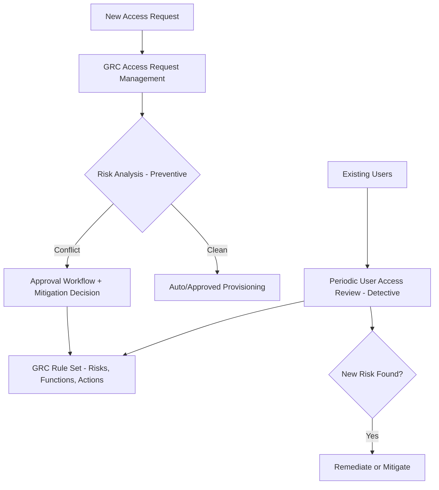

## 1. Beginner Concepts

**Segregation of Duties (SoD)** risk exists when a single user (or role combination) holds access spanning both halves of a sensitive business process without independent oversight (e.g., create a vendor and post a payment to that vendor). **SAP GRC Access Control** automates detection of these conflicts across the entire user/role/authorization landscape using a **rule set** - a library of risk definitions, each mapping to specific transaction/authorization object combinations considered conflicting.

## 2. Intermediate Concepts

The rule set is hierarchical: a **Function** groups the specific transactions/actions representing one half of a business capability (e.g., "Maintain Vendor Master"); a **Risk** pairs two (or more) conflicting functions (e.g., "Maintain Vendor Master" + "Process Vendor Payment"); risks are typically tiered by **business impact** (e.g., high/medium/low). SAP ships a baseline rule set covering common ERP processes, but every organization must customize it to reflect its actual custom transactions, custom authorization objects, and specific risk tolerance.

## 3. Advanced Concepts

**Risk analysis** can run at multiple levels: **user-level** (does this specific user, across all assigned roles, have a conflict), **role-level** (does this role alone, regardless of assignment, contain a conflict - critical for catching problems before roles are ever assigned to anyone), and **permission-level** (deepest granularity, evaluating actual authorization object field values, not just transaction code presence - this catches cases where a transaction is technically assigned but the actual authorization values would prevent the conflicting action from being executable, avoiding false positives).

**Mitigation** is the formal, auditable alternative to remediation when a risk cannot or should not be removed (e.g., a small team where full segregation isn't organizationally feasible): a **Mitigating Control** is documented (what compensating control exists, e.g., a monthly independent reconciliation review), assigned to the specific user/risk combination, and requires periodic review/re-certification - an unmitigated, unremediated risk sitting in a report with no action taken is what auditors specifically flag as a control failure.

## 4. Architect Level Concepts

Designing a GRC Access Control implementation is fundamentally a **governance process design exercise**, not a technical configuration exercise: **Access Request Management (ARM)** should front-run new access provisioning with automated risk analysis *before* a role is assigned (preventive control), while periodic **User Access Review (UAR)** campaigns catch risks that accumulated through role changes, reorgs, or rule set updates over time (detective control). An architecture relying solely on periodic detective review without a preventive ARM-integrated request process will perpetually accumulate new violations faster than periodic reviews can clear them.

## 5. Internal Working

GRC Access Control's risk analysis engine evaluates the target system's actual role/profile/authorization data (synchronized via a periodic or on-demand connector sync from each managed SAP system) against the rule set's function/risk definitions - meaning the analysis is only as current and accurate as the last successful sync; a stale connector sync can produce a risk analysis report that misses recently created roles or recently changed authorizations entirely.

## 6. Real Production Examples

A retail chain's annual external audit flagged dozens of SoD violations that the client's own GRC risk analysis reports had never shown as open - investigation revealed the GRC system's connector sync to the production ECC system had been silently failing for four months due to an expired background job's technical user password, meaning every risk analysis report generated during that window reflected four-month-old role data, missing all subsequent role changes including several that introduced new violations. The remediation included both a technical fix (service account password policy exception for that specific background integration user, properly documented and approved) and a process fix (automated monitoring/alerting on GRC connector sync job success/failure, escalating any failure within 24 hours rather than discovering it at the next audit cycle).

## 7. SAP Notes (Reference Only)

Review current SAP Notes and Help documentation for GRC Access Control rule set update/BC set guidance, connector sync configuration, and Access Request Management workflow customization specific to your GRC release.

## 8. Best Practices

- Monitor GRC connector sync job success/failure actively; never assume risk analysis reports reflect current state without verifying sync health.
- Integrate risk analysis into the access request/provisioning workflow (preventive), not only periodic review cycles (detective).
- Require every accepted risk to have a documented, periodically re-certified mitigating control - never leave violations open with no formal disposition.

## 9. Common Mistakes

- Relying solely on periodic UAR campaigns without preventive ARM-integrated risk analysis at request time.
- Not monitoring connector sync health, leading to risk analysis reports based on stale data.
- Treating rule set configuration as a one-time setup activity rather than an ongoing maintenance process as custom transactions/objects are introduced.

## 10. Interview Questions

- "Your GRC risk reports show zero new violations for six months - is that necessarily good news? What would you check?"
- "Explain the difference between remediation and mitigation, and when each is the right answer."
- "How would you design a GRC governance process that prevents violations rather than just detecting them after the fact?"

## 11. Hands-on Lab

Using a GRC sandbox (or documented walkthrough if hands-on access isn't available), define a simple risk combining two conflicting functions, run a role-level risk analysis against a test role containing both, and document a mitigating control assignment for the resulting violation, including its required re-certification cadence.

## 12. Troubleshooting

| Symptom | Cause | Tool |
|---|---|---|
| Risk analysis missing known recent role changes | Connector sync stale or failing | GRC connector job monitoring |
| Same violation reappears after "remediation" | Fix applied to role but not regenerated/propagated to derived roles | PFCG mass generation, re-run risk analysis |
| Mitigating control listed but no evidence of review | Re-certification process not enforced | GRC mitigation control review workflow |

## 13. Audit Perspective

Auditors specifically test: connector sync health/monitoring evidence, the existence and enforcement of a re-certification cadence for every mitigating control, and whether access requests are risk-analyzed before or only after provisioning - a purely after-the-fact detective-only process is a common and significant finding.

## 14. Performance Impact

Full landscape risk analysis runs (especially permission-level, the deepest granularity) can be resource-intensive at scale; schedule comprehensive analyses during low-usage windows and use narrower scoped analyses for day-to-day request-time checks.

## 15. Security Risks

An unmonitored, silently failing connector sync creates a false sense of security - stakeholders trust "clean" risk reports that no longer reflect reality, which is arguably worse than having no GRC tooling at all if it breeds unwarranted confidence.

## 16. Architecture

GRC governance architecture requires both a preventive layer (ARM-integrated request-time risk analysis) and a detective layer (periodic UAR), backed by active connector sync health monitoring - all three are required; any one alone is insufficient for genuine audit readiness.

## 17. Decision Making

When a genuine SoD conflict can't be organizationally remediated (small team, limited headcount), always formalize it as a documented, re-certified mitigating control rather than an informal "we know about it" acknowledgment - the latter provides no audit evidence and no accountability trail.

## 18. FAQs

**Q: Does assigning a mitigating control remove the risk from future analysis reports?**
A: No, and it shouldn't - a properly configured GRC system continues to show the violation exists, but annotated as mitigated with its control reference, preserving visibility for ongoing governance rather than hiding it.
