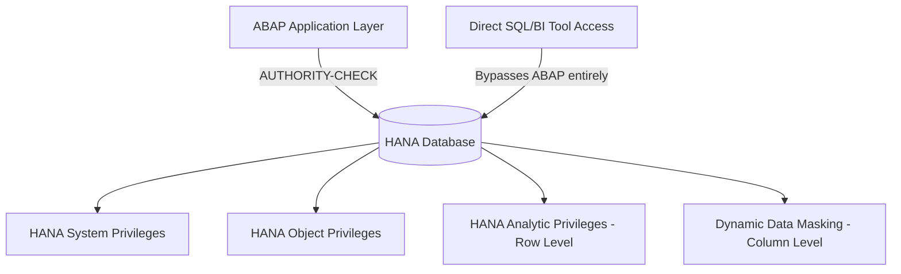

## 1. Beginner Concepts

HANA has its own, completely independent authorization system beneath whatever ABAP or application layer sits on top of it: **System Privileges** (administrative capabilities like backup, user management), **Object Privileges** (SELECT/INSERT/UPDATE/DELETE/EXECUTE on specific schemas, tables, views, procedures), and **Analytic Privileges** (row-level and cell-level restriction on data accessed through analytic/calculation views). A user or application connecting directly to HANA (bypassing the ABAP application layer entirely, e.g., via a BI tool or direct SQL client) is governed purely by these HANA-native privileges.

## 2. Intermediate Concepts

**HANA Roles** bundle privileges (similar conceptually to a PFCG role bundling authorization objects) and can be either **catalog roles** (created directly in the database, harder to transport/version) or **repository roles** (design-time artifacts, versioned and transportable via HANA's development infrastructure - the recommended approach for any managed landscape).

**Analytic Privileges** restrict which rows of a calculation/analytic view a user can see based on attribute values (e.g., restrict to specific cost centers or company codes) - conceptually similar to derived-role org values in ABAP, but enforced at the database query execution layer, meaning it applies even to ad hoc SQL/BI tool access that never passes through any ABAP authorization check at all.

## 3. Advanced Concepts

**Data Masking and Anonymization**: HANA supports column-level dynamic data masking (returning masked/redacted values for unauthorized users without altering underlying data) as a mitigation for sensitive fields (like national ID numbers or salary data) accessed by users who need table access for other columns but not that specific sensitive field - this is a materially different control from analytic privileges (row filtering) and from classic ABAP authorization objects (which don't offer column-level masking natively at all).

**Audit Policies** in HANA define what gets logged (specific privilege usage, specific object access, specific user activity) and at what level (info, alert, emergency) - critically, HANA audit logs are a separate control plane from ABAP-level change documents or Read Access Logging, and must be independently designed, retained, and reviewed.

## 4. Architect Level Concepts

The architecture decision that repeatedly surprises ABAP-background architects: **direct HANA access (bypassing the ABAP application layer) is a distinct attack surface requiring its own complete authorization design** - simply because a data model is "protected" by robust PFCG/AUTHORITY-CHECK design at the ABAP layer does not mean the underlying HANA tables/views are protected if a user or tool connects directly via SQL. Any landscape permitting direct HANA access (common for BI/reporting tools) must have HANA-native privilege design reviewed with the same rigor as ABAP role design.

## 5. Internal Working

Every SQL statement executed against HANA - regardless of whether it originated from the ABAP application server, a BI tool, or a direct SQL console - passes through the same privilege evaluation engine at the database kernel level, checking object privileges for the target object, then applying any analytic privilege row filters and masking rules before returning results. This is why HANA-native security cannot be bypassed by "going around" the application layer, but also why it must be explicitly and separately designed rather than assumed to inherit from application-layer controls.

## 6. Real Production Examples

A healthcare client passed a rigorous ABAP-layer authorization audit with zero findings, then failed a separate infrastructure security review when it was discovered that a BI reporting tool connected directly to HANA using a shared technical database user with essentially unrestricted SELECT access across all schemas - completely bypassing every carefully designed PFCG role and AUTHORITY-CHECK the ABAP audit had validated. Remediation required designing dedicated HANA catalog/repository roles with analytic privilege row-level restrictions matching the equivalent ABAP-layer restrictions, specifically for the BI tool's connection, plus enabling audit policies on that technical user's activity.

## 7. SAP Notes (Reference Only)

Review current SAP Help documentation for HANA privilege model changes across HANA 2.0 SPS levels, and Notes covering dynamic data masking and analytic privilege configuration specific to your HANA revision.

## 8. Best Practices

- Treat every direct (non-ABAP-mediated) HANA access path as requiring its own independent authorization design and review.
- Prefer repository (design-time, transportable) roles over catalog roles for maintainability and change governance.
- Enable and regularly review HANA audit policies for privileged operations and sensitive object access, independent of ABAP-level logging.

## 9. Common Mistakes

- Assuming ABAP-layer authorization protects data accessed via direct SQL/BI tool connections.
- Using catalog roles exclusively, creating an unmanaged, non-transportable security configuration that drifts across environments.
- Never enabling HANA audit policies, leaving no forensic trail for direct database access incidents.

## 10. Interview Questions

- "Your ABAP authorization audit came back clean. Why might the underlying data still be exposed?"
- "Explain the difference between an Analytic Privilege and Dynamic Data Masking - when would you use each?"
- "How would you design HANA-native security for a BI tool that needs direct database access?"

## 11. Hands-on Lab

Create a repository role with an analytic privilege restricting a calculation view to a specific attribute value, assign to a test database user, and confirm row-level filtering occurs even when querying directly via a SQL console rather than through any ABAP application.

## 12. Troubleshooting

| Symptom | Cause | Tool |
|---|---|---|
| BI tool sees more data than expected | No analytic privilege row restriction configured for that connection | HANA Cockpit, role/privilege review |
| Sensitive column values visible to inappropriate users | No dynamic data masking configured | HANA Cockpit, masking rule review |
| No forensic trail after suspected direct DB access misuse | Audit policies not enabled/configured | HANA Cockpit audit policy configuration |

## 13. Audit Perspective

Auditors reviewing database security specifically ask whether direct database access paths (BI tools, ad hoc SQL access, integration middleware) have their own independently designed and reviewed privilege model - "we rely on the ABAP layer" is not a sufficient answer when direct access paths exist.

## 14. Performance Impact

Complex analytic privilege conditions and masking rules on high-volume calculation views can add query overhead; test performance impact on realistic data volumes before production rollout.

## 15. Security Risks

Shared, broadly-privileged technical database users for BI/integration tools are a major, frequently overlooked risk - they bypass individual accountability entirely and often carry far more access than the actual reporting need requires.

## 16. Architecture

HANA-native security must be architected as a first-class, independent layer alongside (not subordinate to) ABAP application-layer authorization whenever any direct database access path exists in the landscape.

## 17. Decision Making

When a new BI or integration tool requests direct HANA access, treat it as a full security design exercise requiring dedicated roles, analytic privileges, and audit policy configuration - never grant it broad SELECT access on an existing shared technical user as a shortcut.

## 18. FAQs

**Q: Do HANA analytic privileges apply to data accessed through Fiori/OData, or only direct SQL access?**
A: They apply universally to any query against the protected view, regardless of entry point - including OData/CDS-based Fiori access, which is exactly why S/4HANA's DCL-based row-level security and HANA analytic privileges are conceptually related but administered through different tooling depending on the access layer.
