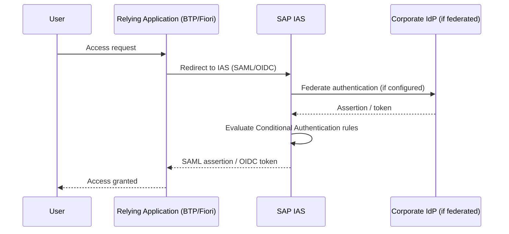

## 1. Beginner Concepts

Identity Authentication Service (IAS) is SAP's cloud identity provider - it authenticates users (via its own user store, or federated to a corporate IdP/Active Directory) and issues SAML assertions or OIDC tokens to relying applications (BTP subaccounts, S/4HANA via SAML2, Fiori Launchpad, third-party apps). Think of IAS as the trust broker sitting between "who the user actually is" and "every application that needs to know."

## 2. Intermediate Concepts

IAS supports two identity models: **acting as the identity provider directly** (users and passwords live in IAS itself) or **acting as a proxy/broker to a corporate IdP** (e.g., federating to Azure AD/Entra ID or another SAML/OIDC IdP, so the corporate directory remains the single source of truth and IAS just relays the authentication). Most enterprise landscapes use the broker pattern - this is a critical architecture decision to get right early, since it determines where password policy, MFA, and account lifecycle actually live.

## 3. Advanced Concepts

**Conditional Authentication** (risk-based rules) lets you require step-up authentication (e.g., MFA) based on conditions like network location (corporate IP range vs. external), application being accessed, user group, or risk signals - this is how modern SAP landscapes implement Zero Trust principles without forcing MFA friction on every single login uniformly.

**Application-level trust configuration** in IAS defines which applications (each a "relying party") can request authentication, what protocol (SAML2 or OIDC) they use, what attributes/claims get sent, and the certificate used to sign assertions - misconfiguration here (wrong Assertion Consumer Service URL, expired signing certificate, attribute mapping typos) is the single largest source of "SSO isn't working" tickets.

## 4. Architect Level Concepts

Multi-IAS-tenant architecture matters for large enterprises with multiple corporate entities, M&A history, or strict regional data residency requirements - deciding whether to run a single IAS tenant for the whole enterprise (simpler governance, single point of trust) versus multiple tenants (isolation, but requires federation/trust between them for shared applications) is a genuine architecture trade-off, not a default choice.

## 5. Internal Working

When federated, IAS itself acts as a **service provider** to the corporate IdP and simultaneously as an **identity provider** to downstream applications - it is not a passive pass-through; it can enrich, transform, or filter attributes between the two legs, and its own trust configuration (to the corporate IdP) is entirely separate from each application's trust configuration (to IAS).

## 6. Real Production Examples

A pharmaceutical client's SSO into a newly onboarded BTP application began failing for exactly one specific business unit's users, while all other users worked fine. Root cause: the corporate IdP's attribute release policy sent a different claim format (a different NameID format) for that business unit due to a legacy AD forest merge that had never been fully harmonized - IAS's attribute mapping for that application expected the standard format and silently failed to map the identity, producing a generic "authentication failed" error with no obvious clue pointing at the real cause. Resolution required correlating IAS's own trace logs with the corporate IdP's federation logs side by side - a reminder that IAS troubleshooting frequently requires visibility into both legs of the federation, not just the IAS-to-application leg.

## 7. SAP Notes (Reference Only)

Check current SAP Help Portal documentation and SAP Notes for IAS conditional authentication rule syntax and known limitations, plus federation attribute mapping guidance specific to your corporate IdP vendor.

## 8. Best Practices

- Document trust configuration (certificates, ACS URLs, attribute mappings) per application in a change-controlled inventory, not just left inside the IAS admin console.
- Set calendar reminders well ahead of signing certificate expiry - expired certificates are a leading cause of sudden, landscape-wide SSO outages.
- Use conditional authentication to apply risk-based MFA rather than uniform blanket MFA, balancing security and user friction.

## 9. Common Mistakes

- Assuming IAS troubleshooting only requires looking at IAS logs, ignoring the corporate IdP's federation logs for federated scenarios.
- Letting signing certificates expire without a renewal process.
- Copy-pasting attribute mapping configuration between applications without verifying each application's actual expected claim format.

## 10. Interview Questions

- "SSO works for most users but fails for one specific group. What's your systematic troubleshooting approach?"
- "When would you choose IAS as a direct identity provider versus a broker to a corporate IdP?"
- "How does Conditional Authentication support a Zero Trust strategy without forcing MFA on every login?"

## 11. Hands-on Lab

Configure a test application's trust relationship in an IAS tenant, deliberately misconfigure the attribute mapping, reproduce the failure, then use IAS trace/logs to identify and correct the root cause.

## 12. Troubleshooting

| Symptom | Cause | Tool |
|---|---|---|
| SSO fails for all users of one application | Trust misconfiguration (ACS URL, certificate) for that app | IAS admin console, application trust config |
| SSO fails for one specific user group only | Attribute mapping mismatch upstream (corporate IdP) | IAS + corporate IdP federation logs |
| Sudden landscape-wide SSO outage | Signing certificate expired | IAS admin console certificate status |

## 13. Audit Perspective

Auditors expect evidence of periodic review of IAS trust relationships (are all configured relying applications still legitimate and in use?) and confirmation that conditional authentication rules align with documented risk-based access policy.

## 14. Performance Impact

Overly complex conditional authentication rule chains can add latency to the authentication flow; keep rules as simple as the risk model genuinely requires.

## 15. Security Risks

An overly permissive "always trust" federation configuration, or missing conditional authentication for high-risk applications, undermines Zero Trust posture even if MFA is technically available but never actually enforced by policy.

## 16. Architecture

IAS sits as the central trust broker in a hub-and-spoke identity architecture - every relying application trusts IAS, and IAS (if brokering) trusts the corporate IdP, meaning IAS availability and correct configuration become a single point of dependency for the entire authentication landscape.

## 17. Decision Making

Choose a single enterprise-wide IAS tenant by default; only fragment into multiple tenants when genuine regulatory, M&A, or data residency requirements demand isolation that can't be achieved through configuration within one tenant.

## 18. FAQs

**Q: Does IAS store user passwords?**
A: Only if configured as a direct identity provider for a given user store. In broker/federated mode, IAS never sees or stores the actual corporate password - it only relays the authentication assertion.
