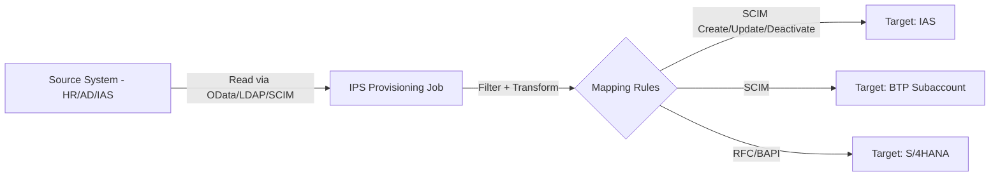

## 1. Beginner Concepts

Identity Provisioning Service (IPS) automates the flow of user and group data from a **source system** (an HR system, Active Directory, IAS itself, or another authoritative store) to one or more **target systems** (S/4HANA, IAS, BTP subaccounts, third-party SCIM-compliant applications). It replaces manual SU01/BTP Cockpit user creation with scheduled or event-driven synchronization jobs.

## 2. Intermediate Concepts

Each source-to-target connection is a **provisioning system** configuration defining: the source's read mechanism (e.g., SuccessFactors OData API, LDAP query, SCIM), the target's write mechanism (SCIM for cloud targets, RFC/BAPI-based for ABAP targets), a **schedule** (or real-time/event-triggered for supported sources), and an **attribute mapping** translating source fields to target fields (e.g., source `costCenter` to target custom attribute).

## 3. Advanced Concepts

**SCIM (System for Cross-domain Identity Management)** is the standard protocol IPS uses to communicate with most cloud targets - understanding SCIM's core operations (Create, Read, Update, Delete/Deactivate on `/Users` and `/Groups` endpoints) is essential for diagnosing why a specific user or group failed to sync, since IPS job logs report success/failure at the SCIM operation level.

**Filters and transformations** in IPS mapping let you conditionally include/exclude users (e.g., only provision users with an active employment status) and transform values (e.g., concatenating first/last name, mapping a source department code to a target role collection name) - errors here are the single largest category of "user exists in the source but never appeared in the target" tickets, because the filter silently excluded them rather than failing loudly.

## 4. Architect Level Concepts

Designing a multi-target provisioning topology requires deciding the **provisioning direction and authority model** per target: some targets should be fully IPS-managed (users only ever created/modified via IPS, manual changes get overwritten on next sync), while others may need a hybrid model (IPS creates the user, but certain attributes remain locally managed) - getting this wrong causes a recurring, confusing pattern where manual fixes "mysteriously" get reverted on the next sync cycle.

## 5. Internal Working

IPS jobs run on their configured schedule (or near-real-time for event-driven-capable sources), reading the full or delta set of source records, applying filters and transformations, then issuing the corresponding SCIM/RFC operations to each target and logging the per-record outcome - a single job run can partially succeed, meaning some users sync correctly while others fail silently unless job logs are actively monitored.

## 6. Real Production Examples

A global manufacturing client discovered, three months after a reorganization, that around 200 users in a newly created cost center had never been provisioned into a critical BTP application - the IPS mapping filter had been written to include users by an explicit cost center allowlist rather than an exclusion-based rule, and the new cost center simply hadn't been added to that allowlist when it was created. No error was ever raised because, from IPS's perspective, those users were correctly and intentionally filtered out by the rule as written. The fix was both technical (switch to an exclusion-based or attribute-driven inclusion model that doesn't require manual allowlist maintenance for new org units) and process-based (add IPS mapping review to the standard org-change checklist).

## 7. SAP Notes (Reference Only)

Review SAP Help documentation and Notes for IPS job scheduling limits, SCIM schema extension guidance, and known source-system-specific connector behaviors (e.g., SuccessFactors, Azure AD) relevant to your landscape.

## 8. Best Practices

- Prefer exclusion-based or attribute-driven inclusion filters over manually maintained allowlists that require updates for every org change.
- Monitor IPS job logs proactively (success/failure/partial-failure counts), not just when someone reports missing access.
- Clearly document, per target system, whether it is fully IPS-managed or hybrid-managed, and enforce that boundary in change management.

## 9. Common Mistakes

- Silent filter exclusions being mistaken for "the sync must be broken" when in fact the rule is working exactly as configured.
- Manually fixing a user record in a fully IPS-managed target, only to have it reverted on the next sync.
- Not monitoring job logs, discovering sync failures only when users report missing access weeks or months later.

## 10. Interview Questions

- "A new cost center's users never got provisioned into a downstream application. How do you investigate?"
- "How would you decide which attributes should be IPS-managed versus locally managed in a hybrid target?"
- "Explain how SCIM operations map to IPS job log entries, and how you'd use that to debug a partial sync failure."

## 11. Hands-on Lab

Configure a simple source-to-target IPS job with an attribute-based inclusion filter, run it, then modify the filter to exclude a test user, rerun, and confirm the deactivation/removal behavior on the target - documenting exactly what happens to an excluded user who was previously provisioned.

## 12. Troubleshooting

| Symptom | Cause | Tool |
|---|---|---|
| User missing entirely from target | Filter excluding them (often silently) | IPS mapping/filter review, job logs |
| Manual target fix keeps reverting | Target is fully IPS-managed, sync overwrites | IPS job configuration, target management model |
| Some users sync, others in same batch fail | Attribute transformation error for specific records | IPS job log, per-record error detail |

## 13. Audit Perspective

Auditors expect evidence that provisioning and de-provisioning are timely and automated wherever feasible, with job failure alerting demonstrably in place - a manual, ad hoc provisioning process for any in-scope system is a common finding in mature audit programs.

## 14. Performance Impact

Very large full-sync jobs (rather than delta/incremental syncs) against large user populations can be slow and resource-intensive; prefer delta sync configurations where the source system supports it.

## 15. Security Risks

A provisioning filter that fails open (includes everyone by default when a specific condition can't be evaluated) can over-provision access; always design filters to fail closed (exclude by default on ambiguous/error conditions).

## 16. Architecture

IPS sits as the automation layer between authoritative identity sources and every downstream target requiring user/group data - its filter and mapping configuration is effectively a security control in its own right, not merely a data integration convenience.

## 17. Decision Making

When a target system needs some locally-managed attributes alongside IPS-provisioned core identity data, explicitly scope IPS's mapping to exclude those locally-managed fields entirely rather than syncing them and hoping conflicts don't occur - partial ownership within a single field is a recipe for silent reverts.

## 18. FAQs

**Q: Does deactivating a user in the source system immediately deactivate them everywhere downstream?**
A: Only as fast as each target's provisioning job schedule runs - if a target syncs nightly, a source deactivation at 9am could leave access active in that target for up to 24 hours, which is why urgent terminations should always be paired with a manual out-of-cycle action, not just reliance on the next scheduled sync.
