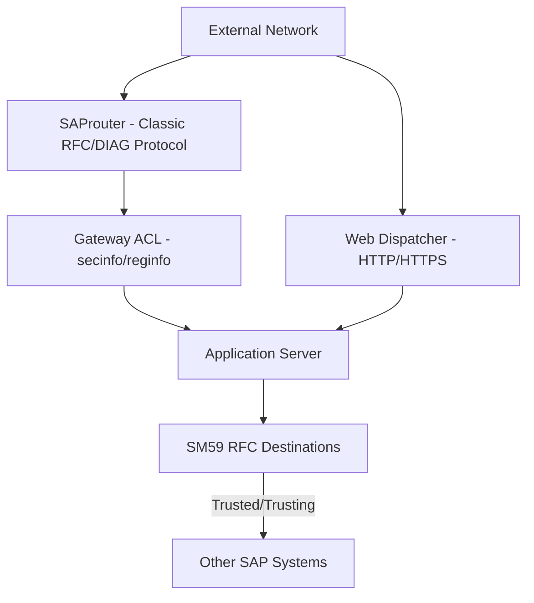

## 1. Beginner Concepts

Application-layer authorization (PFCG, AUTHORITY-CHECK) assumes a request has already legitimately reached the system - network and transport-layer controls are what decide whether that assumption is safe. **RFC (Remote Function Call)** is SAP's system-to-system communication protocol; **SAProuter** is a proxy controlling network-level routing between SAP systems and external networks; **Web Dispatcher** load-balances and can filter HTTP(S) traffic to ABAP application servers; **Transport Management System (STMS)** governs how code and configuration changes move between systems.

## 2. Intermediate Concepts

**Gateway ACLs** (`secinfo` and `reginfo` files, managed via `SMGW`) control which external programs/hosts may register as RFC servers and which may invoke RFC function modules on the gateway - historically many systems shipped with dangerously permissive or entirely absent ACL files, a well-known and heavily exploited vulnerability class in older SAP landscapes. `SM59` maintains RFC destinations, including the trust model (trusted/trusting system relationships) and stored credentials - a destination configured with a stored user/password grants that access to anyone able to use that destination, regardless of the calling user's own authorization.

## 3. Advanced Concepts

**Trusted/Trusting RFC connections** let a calling system pass through the current user's identity without re-authenticating, which is powerful for SSO-like scenarios between SAP systems but dangerous if misconfigured - a trusting system must carefully restrict which calling systems and which specific users are permitted to use the trust relationship (via authorization object `S_RFCACL`), or it effectively extends its own trust boundary to encompass the security of every trusted system upstream.

**Transport security** extends beyond simple approval workflows: transport requests can carry authorization-relevant objects (roles, SU24 entries, DCL definitions) that must be reviewed with the same rigor as code changes, and an improperly secured transport directory or STMS configuration allowing unauthorized import can bypass change control entirely.

## 4. Architect Level Concepts

Perimeter architecture for SAP landscapes typically layers: external network → **Web Dispatcher** (HTTP/HTTPS termination, URL filtering, load balancing) → application servers, and separately, **SAProuter** for classic SAP GUI/RFC protocol routing, often paired with **SNC (Secure Network Communications)** for encryption and stronger authentication on that channel. Architecting this correctly means understanding that Web Dispatcher and SAProuter protect *different* protocols and neither substitutes for the other - a landscape hardened only at the HTTP layer via Web Dispatcher remains exposed on the classic RFC/DIAG protocol if SAProuter and gateway ACLs aren't equally rigorous.

## 5. Internal Working

The SAP Gateway process evaluates every incoming RFC registration or call attempt against `secinfo`/`reginfo` before any application-layer authorization is even considered - a request blocked at this layer never reaches `AUTHORITY-CHECK` at all, which is precisely why gateway misconfiguration was historically such a severe class of vulnerability: it operates entirely outside and prior to the authorization concept most security consultants focus on.

## 6. Real Production Examples

A security assessment for a manufacturing client discovered a production system's gateway `secinfo` file was essentially empty (default permissive behavior), meaning any host on the internal network could register arbitrary RFC server programs and potentially execute function modules with no restriction - a finding entirely invisible to a PFCG/role-focused review, since it existed underneath and outside the application authorization layer entirely. Remediation required a carefully staged rollout of restrictive ACL files (tested extensively in non-production first, since overly aggressive ACLs can break legitimate interfaces), following SAP's documented secure-by-default gateway configuration guidance.

## 7. SAP Notes (Reference Only)

Review current SAP Notes and Security Guides for Gateway ACL (`secinfo`/`reginfo`) secure configuration baselines, SAProuter security recommendations, and Web Dispatcher hardening guidance specific to your kernel/release.

## 8. Best Practices

- Maintain restrictive, explicitly reviewed `secinfo`/`reginfo` gateway ACL files on every system - never rely on default/empty configuration.
- Scope trusted/trusting RFC relationships as narrowly as possible using `S_RFCACL`, never as a blanket "trust everything from this system" configuration.
- Review transport requests for authorization-relevant objects (roles, SU24, DCL) with the same governance rigor as code changes.

## 9. Common Mistakes

- Assuming application-layer authorization design compensates for weak or absent gateway ACLs.
- Configuring trusted RFC relationships too broadly, effectively merging the trust boundary of two systems unintentionally.
- Treating transport approval as purely a code-quality gate, missing its equally important role as a security control point.

## 10. Interview Questions

- "Why can a system be fully compliant on PFCG role design and still be critically vulnerable at the network layer?"
- "Explain the risk of an overly permissive trusted/trusting RFC relationship."
- "What's the difference between what SAProuter and Web Dispatcher each protect?"

## 11. Hands-on Lab

In a sandbox, review a system's current `secinfo`/`reginfo` configuration via `SMGW`, identify overly permissive entries, and draft a restrictive replacement following SAP's documented secure configuration guidance, testing against known legitimate interfaces before considering it production-ready.

## 12. Troubleshooting

| Symptom | Cause | Tool |
|---|---|---|
| Legitimate RFC interface suddenly blocked | Gateway ACL tightened without allowlisting the interface | SMGW, gateway logs |
| Unexpected cross-system access via trusted RFC | Overly broad trust relationship, missing S_RFCACL restriction | SMT1/SM59 trust configuration |
| Unauthorized change appeared in production | Transport approval process bypassed or misconfigured | STMS, transport logs |

## 13. Audit Perspective

Auditors increasingly include gateway ACL and RFC trust configuration review in SAP security assessments - a review scoped only to PFCG/role design without examining `secinfo`/`reginfo` and trust relationships is now considered materially incomplete.

## 14. Performance Impact

Gateway ACL evaluation adds negligible overhead; the operational risk is in getting configuration wrong (blocking legitimate traffic), not performance.

## 15. Security Risks

Default or missing gateway ACLs, overly broad RFC trust relationships, and unreviewed transport imports collectively represent a category of risk entirely independent of and invisible to application-layer authorization review - this remains one of the most under-assessed areas in real-world SAP security programs.

## 16. Architecture

Defense-in-depth for SAP landscapes requires securing every layer independently: network perimeter (SAProuter/Web Dispatcher), gateway (ACLs), RFC trust (SM59/S_RFCACL), transport governance (STMS), and only then application authorization (PFCG) - each layer assumes the ones below it are already sound.

## 17. Decision Making

When two SAP systems need to communicate with SSO-like trust, evaluate whether a narrowly-scoped trusted RFC relationship (with explicit S_RFCACL restriction) is truly necessary versus a standard authenticated RFC destination with its own scoped technical user - default to the latter unless the trust use case is clearly justified.

## 18. FAQs

**Q: Does SNC (Secure Network Communications) replace the need for gateway ACLs?**
A: No - SNC provides encryption and stronger authentication for the communication channel itself; it says nothing about which programs/hosts are permitted to register or call RFC function modules, which remains entirely governed by gateway ACL configuration.
