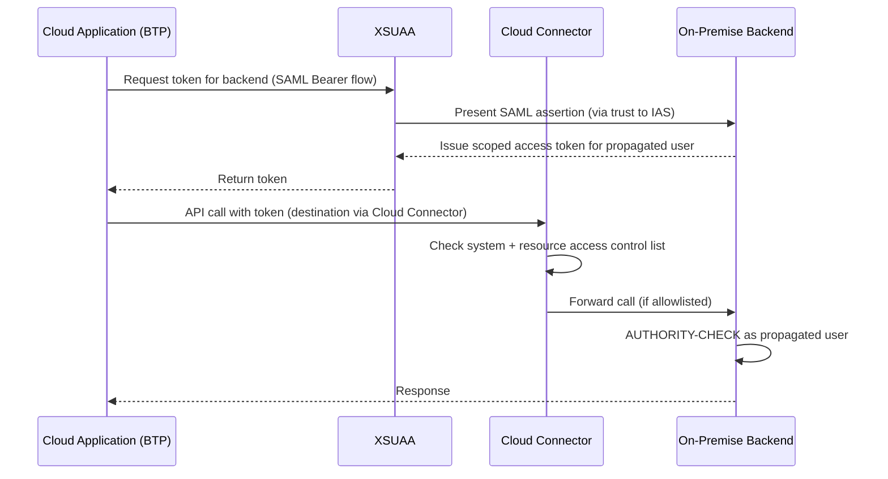

## 1. Beginner Concepts

**Principal Propagation** solves a specific, common architecture problem: a user authenticates to a cloud application (BTP), but the cloud application needs to call an on-premise SAP backend *as that same user*, not as a generic technical/service user - preserving individual accountability, authorization, and audit trail across the cloud-to-on-premise boundary.

## 2. Intermediate Concepts

The mechanism relies on **OAuth 2.0 SAML Bearer Assertion flow**: the cloud application (holding the user's identity, typically via an XSUAA-issued JWT) requests a new token from the on-premise system's OAuth server, presenting a SAML assertion (issued by IAS, trusted by the backend) that vouches for the user's identity - the backend then issues a short-lived access token scoped to that user, which the cloud app uses for the actual API call, routed through **Cloud Connector**.

## 3. Advanced Concepts

**Cloud Connector** is the on-premise agent establishing a secure tunnel from the customer's network to their BTP subaccount, without requiring inbound firewall openings (the connection is always initiated outbound from on-premise to cloud). It enforces **access control lists** at both the system level (which backend systems/hosts are exposed at all) and the resource level (which specific URL paths/services on each system are reachable) - a resource not explicitly allowlisted in Cloud Connector is unreachable regardless of what authorization the calling user has on the backend.

Principal Propagation additionally requires the backend system to trust the certificate Cloud Connector presents (or, in the SAML Bearer flow, trust IAS as the assertion issuer) - meaning there are actually **two separate trust relationships** in play: Cloud Connector's own connectivity trust to the backend, and the identity/principal propagation trust for the actual user context.

## 4. Architect Level Concepts

Distinguishing failure domains is the core architect-level skill here: a request can fail at the **Cloud Connector access control** layer (resource not allowlisted - fails before ever reaching backend authorization), the **principal propagation/trust** layer (assertion not trusted, or backend user mapping missing), or the **backend authorization** layer (classic AUTHORITY-CHECK failure once the user context is correctly established) - and each produces different, easily confused error signatures.

## 5. Internal Working

The backend's user mapping (principal propagation requires the on-premise system to resolve the asserted cloud identity to an actual local SAP user, either via a 1:1 mapping table or an identity federation configuration keyed on a matching attribute like email or a corporate ID) is a frequently overlooked configuration step - without it, even a perfectly valid, correctly trusted assertion has no local user to authorize against, and the call fails with an identity-resolution error rather than an authorization error.

## 6. Real Production Examples

An insurance client's new BTP-based claims application worked flawlessly in testing with a handful of pilot users, then broke for the majority of the wider rollout population - the backend user mapping had been manually created only for the pilot users' specific accounts, and the broader rollout assumed (incorrectly) that principal propagation would work automatically for any valid IAS-authenticated user without an explicit mapping. The architecture was corrected to use attribute-based identity federation (matching a shared corporate email attribute) rather than manually maintained 1:1 mapping table entries, eliminating the scaling bottleneck entirely.

## 7. SAP Notes (Reference Only)

Review current SAP Help documentation and Notes for Cloud Connector access control configuration best practices and Principal Propagation setup guides specific to your BTP runtime and backend release.

## 8. Best Practices

- Use attribute-based identity federation for user mapping wherever the backend supports it, rather than manually maintained per-user mapping tables that don't scale.
- Keep Cloud Connector access control lists as narrow as functionally required - allowlist specific resource paths, not entire systems, wherever possible.
- Document and test all three failure domains (Cloud Connector ACL, propagation trust, backend authorization) as distinct troubleshooting branches in your support runbook.

## 9. Common Mistakes

- Assuming principal propagation "just works" for any authenticated cloud user without explicit backend user mapping configuration.
- Allowlisting entire backend systems in Cloud Connector instead of specific required resources, expanding attack surface unnecessarily.
- Confusing a Cloud Connector ACL rejection with a backend authorization failure - they require entirely different fixes.

## 10. Interview Questions

- "A cloud app can't reach an on-premise resource. How do you determine whether it's a Cloud Connector, trust, or backend authorization problem?"
- "Explain principal propagation to someone who only knows classic ABAP authorization - what's actually being propagated, and how?"
- "Why might principal propagation work for 5 pilot users but fail when rolled out to 500?"

## 11. Hands-on Lab

In a sandbox landscape, configure Cloud Connector with a deliberately narrow resource allowlist, attempt to call a non-allowlisted path and observe the specific rejection signature, then widen the allowlist and repeat, comparing against a backend authorization failure for contrast.

## 12. Troubleshooting

| Symptom | Cause | Tool |
|---|---|---|
| Connection refused before reaching backend | Cloud Connector ACL not allowlisting the resource | Cloud Connector admin UI, access control log |
| Identity resolution error, no local user found | Missing/incorrect backend user mapping | Backend identity federation/mapping configuration |
| Reaches backend but authorization fails | Classic AUTHORITY-CHECK gap for the propagated user | SU53/STAUTHTRACE on the backend, as that user |

## 13. Audit Perspective

Auditors reviewing hybrid landscape access should verify that Cloud Connector access control lists are reviewed periodically and scoped to least privilege, and that principal propagation preserves individual accountability rather than collapsing to a shared technical user identity for convenience.

## 14. Performance Impact

Each hop (cloud app → XSUAA → Cloud Connector → backend) adds latency; monitor end-to-end call performance especially for high-volume integration scenarios and consider connection pooling/caching where appropriate.

## 15. Security Risks

Overly broad Cloud Connector system-level exposure (rather than resource-level scoping) significantly increases the blast radius if the cloud application or its credentials are ever compromised.

## 16. Architecture

The complete trust chain spans: cloud identity (IAS) → XSUAA token issuance → Cloud Connector network/ACL trust → backend principal propagation trust → backend classic authorization - a genuine end-to-end architecture diagram for any hybrid scenario must show all five links, not just the cloud or on-premise half alone.

## 17. Decision Making

When a new hybrid integration is proposed, decide early whether it genuinely needs principal propagation (preserving individual user context) or whether a scoped technical/service user with its own tightly restricted backend authorization is sufficient and simpler - not every integration needs the complexity of full principal propagation.

## 18. FAQs

**Q: Does Cloud Connector store or see the actual user's password?**
A: No - Cloud Connector only tunnels already-authenticated, already-tokenized traffic; it has no visibility into or role in the original authentication event itself.
