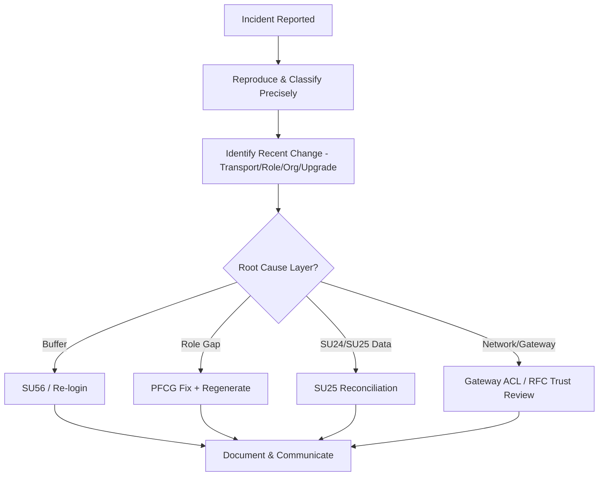

## 1. Beginner Concepts

Production support security work differs fundamentally from project/greenfield role design: it is reactive, time-pressured, and requires triaging correctly under uncertainty - the first job in any war-room is **containment and correct problem classification**, not immediately jumping to a fix, because an incorrect fix applied under pressure (like broadly widening an authorization "to make the error go away") often creates a larger, harder-to-reverse problem than the original incident.

## 2. Intermediate Concepts

A disciplined **Root Cause Analysis (RCA)** methodology for authorization incidents follows: (1) reproduce and classify the failure precisely (which object, which transaction, which user, since when), (2) identify what changed recently (transport, role change, org restructure, upgrade, SU25 step) as the most likely trigger, (3) trace the actual mechanism (buffer staleness vs. genuine role gap vs. SU24/SU25 data change vs. network/gateway layer), (4) apply the narrowest fix that addresses the confirmed root cause, (5) document and communicate before closing.

## 3. Advanced Concepts

**Migration and upgrade projects** introduce security risks entirely distinct from steady-state operations: SU25 steps must be executed and reviewed (missing this silently leaves new SAP-delivered authorization objects unassigned or previously-disabled checks suddenly re-enabled); custom Z-transactions must have SU24 proposals re-verified after major release changes; and role redesign scope (especially ECC-to-S/4HANA, where Fiori catalogs and DCL roles are new artifacts entirely) must be planned as a first-class workstream with its own timeline, not an afterthought squeezed into the final weeks of a technical migration project.

## 4. Architect Level Concepts

At the architect/lead level, the skill being tested in interviews is **judgment under ambiguity and organizational influence** - can you correctly triage a genuinely ambiguous incident (is this an authorization issue, a data issue, or an integration issue?) while also managing stakeholder pressure for an immediate fix, without compromising the eventual root-cause-based resolution. This is where **behavioral and leadership** interview questions intersect directly with technical troubleshooting depth.

## 5. Internal Working

Post-upgrade authorization issues frequently stem from the interaction between SU25's automated comparison logic and manually customized SU24 entries - if a customer previously overrode a SAP-delivered default (e.g., changed "Check/Maintain" to "Check" for a specific object) and the upgrade ships a new default for that same object, SU25's merge step requires an explicit decision about which value wins; skipping careful review here is the single most common root cause of "everything looks fine in QA but breaks unpredictably in production after go-live" authorization incidents.

## 6. Real Production Examples

A consumer goods company's S/4HANA go-live weekend RCA process was tested for real: order processing authorization worked perfectly for all users in one plant but failed for identical roles in a second plant added mid-project. The war-room initially suspected a data issue (org structure misconfiguration) for the first two hours, until a security architect insisted on reproducing with STAUTHTRACE rather than continuing to speculate - the trace revealed the second plant's derived role had simply never been regenerated after its org value was added late in the project, a straightforward PFCG fix that would have been found in minutes with proper trace-first discipline instead of two hours of data-layer speculation. The retrospective's key lesson, now embedded in that client's incident runbook: **always trace before theorizing** in any ambiguous authorization-adjacent incident, no matter how confident the initial hypothesis feels.

## 7. SAP Notes (Reference Only)

Review release-specific SAP Notes and Upgrade/Migration Guides for SU25 step sequencing, and any known post-upgrade authorization object behavior changes for your specific S/4HANA release path.

## 8. Best Practices

- Establish a non-negotiable "reproduce and trace first" discipline for any authorization-adjacent production incident, resisting pressure to theorize or broadly widen access under time pressure.
- Treat SU25 execution and review as a mandatory, resourced workstream in every upgrade/migration project plan, not an assumed-automatic technical step.
- Build a documented RCA template that captures classification, trigger, mechanism, fix, and communication for every significant incident, creating an organizational knowledge base over time.

## 9. Common Mistakes

- Widening authorization broadly under war-room pressure "to make the error go away," creating larger, harder-to-reverse problems.
- Treating SU25 as an assumed-automatic upgrade step rather than a resourced, reviewed workstream.
- Speculating about root cause for extended periods before using trace tools to actually confirm the mechanism.

## 10. Interview Questions

- "Walk me through a real production authorization incident you led the RCA for, end to end."
- "How do you balance stakeholder pressure for an immediate fix against the discipline of proper root cause analysis?"
- "What security-specific risks do you build into an S/4HANA migration project plan that a purely technical migration team might miss?"

## 11. Hands-on Lab

Simulate a war-room exercise: given a scripted scenario (a role works for most users but fails for a specific subset after a recent org change), practice the five-step RCA methodology end-to-end, documenting your classification, hypothesis, trace evidence, fix, and communication draft.

## 12. Troubleshooting

| Symptom | Cause | Tool |
|---|---|---|
| Works in QA, fails unpredictably in production post-upgrade | SU25 merge decision not properly reviewed | SU25 comparison logs, SU24 entry history |
| Fails for a subset of otherwise-identical users | Derived role not regenerated for a specific org value | PFCG mass generation log |
| Ambiguous symptom, multiple plausible causes | Team theorizing instead of tracing | STAUTHTRACE, disciplined RCA process |

## 13. Audit Perspective

Auditors reviewing change management maturity look for documented RCA records demonstrating that incidents were resolved based on confirmed root cause rather than broad access widening, and evidence that upgrade projects included a formal security/authorization workstream with its own sign-off.

## 14. Performance Impact

Under-resourced SU25/role redesign workstreams in migration projects often lead to rushed, broad-brush authorization fixes post-go-live that later require significant rework - proper upfront investment reduces total lifecycle cost and incident volume.

## 15. Security Risks

War-room pressure is a genuine security risk vector in itself - broad, undocumented "temporary" access widening applied to resolve an incident quickly frequently becomes permanent because no one circles back to narrow it once the pressure subsides.

## 16. Architecture

Production support and migration security processes should be architected with the same rigor as any other control: documented RCA methodology, mandatory SU25 workstream in every upgrade project, and a governance mechanism ensuring "temporary" incident-driven access changes are tracked and reversed.

## 17. Decision Making

When under war-room pressure to grant broad emergency access as an immediate fix, default to a time-boxed Firefighter/emergency access grant (with mandatory logging and review) rather than a permanent role change - this satisfies the urgency while preserving governance and an automatic expiry.

## 18. FAQs

**Q: Is a production authorization incident always a security team problem to resolve alone?**
A: No - the most effective RCA processes involve security, Basis, and the functional/application team together, since the root cause (and correct fix) can live in any of those layers, and single-discipline troubleshooting frequently misses cross-layer root causes like the org-value regeneration example above.
