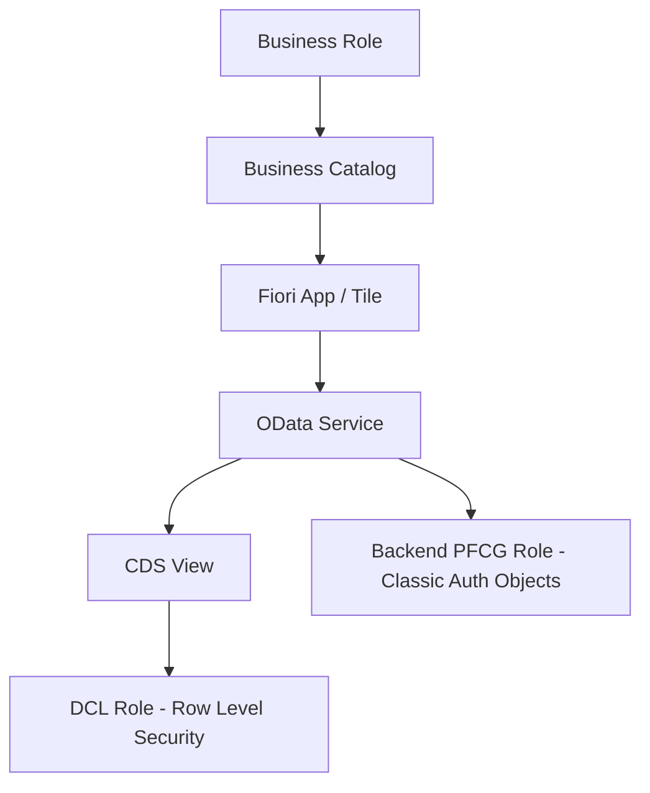

## 1. Beginner Concepts

S/4HANA does **not** replace the ABAP authorization concept - `AUTHORITY-CHECK`, PFCG, SU24 all still apply exactly as in ECC. What changes is the **surface area**: transactions are increasingly wrapped or replaced by Fiori apps, analytics runs embedded on the HANA database instead of in separate BW systems, and role design shifts from transaction-code-centric to **business-role/business-catalog-centric**.

## 2. Intermediate Concepts

**Business Roles** in S/4HANA bundle **Business Catalogs** (groups of related Fiori apps) and **Business Groups**, which is the Fiori-era evolution of the composite/single role pattern - but underneath, each catalog still maps back to PFCG roles carrying the actual authorization objects for the OData services and CDS views involved.

**Embedded Analytics** introduces **Analysis Authorizations** (still primarily a BW/embedded-BW concept, object `S_RS_AUTH`) and **DCL (Data Control Language)** for CDS view-level row/column restriction - a genuinely new authorization layer that doesn't exist in classic ECC transaction-based security.

## 3. Advanced Concepts

CDS view authorization uses `@AccessControl.authorizationCheck` annotations, pointing to a **DCL role** that defines row-level restrictions (e.g., restrict which company codes' data a CDS view returns for a given user) - this is enforced at the database/view layer, independent of and in addition to the classic AUTHORITY-CHECK in application logic. An architect must be able to explain that a user can pass every classic authorization check and still see zero rows if the DCL role restricts the CDS view's data.

## 4. Architect Level Concepts

Migrating role design from ECC to S/4HANA is rarely a lift-and-shift. The architecture decision is whether to: (a) redesign business roles top-down around Fiori catalogs/groups (clean but resource-intensive), (b) convert existing ECC roles and bolt on Fiori catalog assignments (faster, but perpetuates ECC-era role sprawl), or (c) hybrid - redesign only for processes with significant Fiori app coverage, keep ECC-style roles for remaining GUI transactions. Real programs use (c) far more often than either extreme.

## 5. Internal Working

When a Fiori app calls its backing OData service, the Gateway/Fiori layer first checks the classic authorization objects proposed via SU24 for that service (exactly like any transaction), then the underlying CDS view evaluates its DCL role for row-level filtering, and finally any analytic privilege (for embedded analytics scenarios) further restricts aggregated data visibility. All three layers must independently pass.

## 6. Real Production Examples

A discrete manufacturing client migrating to S/4HANA found that a Fiori app displaying "My Purchase Orders" showed different row counts for identical users in QA versus Production - root cause was a DCL role in QA that hadn't been transported alongside its corresponding backend PFCG role, since the two live in different transport object types and were tracked by different teams during cutover. Fix: added CDS/DCL objects explicitly to the security team's transport checklist, not just the Basis/Development checklist.

## 7. SAP Notes (Reference Only)

Review current SAP Notes on CDS view authorization annotation syntax changes per S/4HANA release, and on Fiori catalog/group-to-PFCG-role synchronization behavior - verify against your specific release.

## 8. Best Practices

- Maintain DCL roles under the same change/transport governance as PFCG roles - never let them drift independently.
- Use business catalogs as the assignment unit for end users; keep PFCG role editing as a backend security team activity.
- Test authorization at all three layers (classic object, DCL, analytic privilege) independently during UAT, not just end-to-end.

## 9. Common Mistakes

- Assuming a user's classic PFCG authorization is the complete picture in S/4HANA - ignoring DCL/CDS-level restriction.
- Forgetting to transport DCL roles alongside their associated backend authorization objects.
- Treating "business catalog assignment" as equivalent to a full authorization redesign when the underlying PFCG roles were never actually revisited.

## 10. Interview Questions

- "A user passes every authorization check you can find in SU53, but a Fiori app still shows zero data. What else would you check?"
- "How would you structure a role redesign program for an ECC-to-S/4HANA migration with 3,000 existing roles?"

## 11. Hands-on Lab

In a sandbox, create a simple CDS view with a DCL restriction on company code, assign a user full classic authorization for the underlying table, and demonstrate that the DCL restriction still filters visible rows - proving the two layers are independent.

## 12. Troubleshooting

| Symptom | Cause | Tool |
|---|---|---|
| Zero rows despite full classic authorization | DCL role restricting CDS view | Check DCL role definition, `RSECADMIN` |
| Fiori tile missing from launchpad | Business catalog/group not assigned | `LPD_CUST` / Fiori Launchpad Designer, business role assignment |
| Aggregated analytics values wrong/hidden | Analysis authorization gap | `RSECADMIN`, `S_RS_AUTH` |

## 13. Audit Perspective

Auditors in S/4HANA environments increasingly ask for evidence that row-level (DCL) security was explicitly tested, not just assumed from classic authorization design - this is a newer audit expectation than in pure ECC landscapes.

## 14. Performance Impact

Overly complex DCL role conditions (deeply nested subqueries) can degrade CDS view performance at scale; keep row-level restriction logic as simple and indexed-field-based as possible.

## 15. Security Risks

A DCL role that is too permissive (or missing entirely, defaulting to unrestricted) silently exposes cross-company-code or cross-plant data through embedded analytics even when classic transaction authorization looks correctly scoped.

## 16. Architecture

Treat the authorization architecture as three enforced layers - Application (AUTHORITY-CHECK/OData), Data Row-Level (DCL/CDS), and Analytical (Analysis Authorizations) - and document all three per business role, not just the first.

## 17. Decision Making

When a business process spans both classic GUI transactions and new Fiori apps, decide role ownership boundaries early: one backend PFCG role can back both a GUI transaction and a Fiori app's OData service, so avoid duplicating authorization objects across a "GUI role" and a "Fiori role" for the same business function.

## 18. FAQs

**Q: Do I still need SU24 in S/4HANA?**
A: Yes, entirely unchanged in mechanism - Fiori apps' OData services still get authorization object proposals via SU24 exactly like classic transactions.
