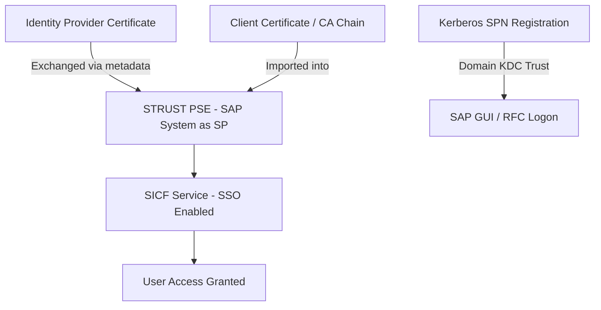

## 1. Beginner Concepts

Single Sign-On (SSO) means a user authenticates once and gains access to multiple systems without re-entering credentials. In SAP landscapes, this is achieved through several distinct mechanisms that are frequently confused: **SAML2** (assertion-based federation, most common for browser-based Fiori/web access), **Kerberos** (ticket-based, common for domain-joined desktop SAP GUI/RFC scenarios), and **X.509 client certificates** (certificate-based mutual authentication, common for system-to-system or high-assurance user scenarios).

## 2. Intermediate Concepts

SAP systems manage trust relationships and certificates through **STRUST** (Trust Manager), which maintains the Personal Security Environment (PSE) for each application server, and **SICF** node configuration for enabling SAML2/certificate-based logon on specific HTTP services. SAML2 configuration in an ABAP system (`SAML2` transaction) defines the system as a Service Provider, trusting one or more Identity Providers (like IAS), with metadata exchange (entity ID, certificates, endpoints) establishing the actual trust.

## 3. Advanced Concepts

**Certificate chains matter more than the leaf certificate** - a common failure mode is a valid, non-expired leaf certificate failing validation because an intermediate CA certificate in the chain expired or was never imported into the trusting system's PSE. STRUST must contain the complete chain (or the trusting party must otherwise be able to build it) for validation to succeed; partial chains fail silently in ways that look identical to "wrong certificate" errors.

**Kerberos SSO** for SAP GUI relies on SPNEGO and requires the SAP system to have a correctly registered **Service Principal Name (SPN)** in the domain's Key Distribution Center, plus correctly synchronized clocks (Kerberos tickets are time-sensitive; more than ~5 minutes of clock skew between client, KDC, and server commonly breaks authentication with cryptic errors).

## 4. Architect Level Concepts

Certificate lifecycle governance is an architecture responsibility, not just a Basis operational task: every trust relationship (SAML2 IdP/SP pairs, client certificate CAs, Kerberos SPNs) needs a documented owner, an expiry monitoring mechanism, and a renewal runbook tested well before expiry - "the SSO outage that happens once a year when nobody remembers the cert needs renewing" is one of the most common, most avoidable production incidents in SAP landscapes.

## 5. Internal Working

For SAML2, when a user accesses an SP-configured SICF service, the ABAP system redirects to the configured IdP, receives a signed SAML assertion back, validates the signature against the IdP's certificate stored in its PSE (via STRUST), checks the assertion's validity window and audience restriction, then maps the asserted NameID/attributes to a local SAP user (via user mapping table or identity federation configuration) before granting the session.

## 6. Real Production Examples

A retail client's entire Fiori Launchpad SSO landscape went down simultaneously across production, QA, and development on the same morning - the shared corporate root CA certificate used across all three systems' SAML trust configuration had expired overnight, and because it was a shared root imported years earlier during initial setup, no individual system-level certificate renewal alert had ever been configured to track it (renewal alerts were only set on leaf/intermediate certificates, not the root). The remediation included a landscape-wide certificate inventory audit covering every level of every trust chain, not just leaf certificates, with monitoring configured accordingly.

## 7. SAP Notes (Reference Only)

Check SAP Notes for STRUST/SAML2 configuration guidance and known certificate chain validation issues per your NetWeaver release, and consult your Kerberos/AD administrators' documentation for SPN registration requirements specific to your domain setup.

## 8. Best Practices

- Maintain a complete certificate inventory across every trust relationship and every level of every certificate chain, with expiry monitoring on all of them, not just leaf certificates.
- Test certificate renewal procedures well ahead of actual expiry dates, in a non-production system first.
- Keep client, KDC, and SAP application server clocks synchronized (NTP) to avoid Kerberos clock-skew failures.

## 9. Common Mistakes

- Monitoring only leaf certificate expiry and missing intermediate/root certificate expiry in the same chain.
- Assuming a "certificate error" is always about the specific certificate named in the error message, rather than a chain issue.
- Ignoring clock synchronization as a Kerberos SSO prerequisite until it causes an outage.

## 10. Interview Questions

- "SSO broke simultaneously across three systems overnight. What's your first hypothesis and how do you confirm it?"
- "Explain why a valid, non-expired certificate can still fail trust validation."
- "What's the difference between what SAML2, Kerberos, and X.509 client certificates each actually authenticate, and when would you choose each?"

## 11. Hands-on Lab

In a sandbox system, configure SAML2 trust to a test IdP, deliberately remove the intermediate CA certificate from STRUST while leaving the leaf certificate intact, reproduce the resulting trust failure, then restore the full chain and confirm resolution.

## 12. Troubleshooting

| Symptom | Cause | Tool |
|---|---|---|
| SSO fails with generic trust error | Incomplete certificate chain in STRUST | STRUST, certificate chain inspection |
| Kerberos SSO fails intermittently | Clock skew between client/KDC/server | NTP configuration, domain controller logs |
| SSO worked yesterday, fails today landscape-wide | Certificate expired overnight | STRUST expiry dates, certificate monitoring |

## 13. Audit Perspective

Auditors expect a documented certificate inventory with ownership and renewal evidence for every trust relationship - "we didn't know that certificate existed" is not an acceptable answer during an audit or an incident postmortem.

## 14. Performance Impact

Certificate validation adds minor per-request overhead; the larger risk is availability (outage on expiry), not steady-state performance.

## 15. Security Risks

Weak or deprecated cipher suites/algorithms in old certificate configurations can undermine the cryptographic assurance SSO is meant to provide - periodically review and upgrade certificate algorithms and key lengths, not just track expiry dates.

## 16. Architecture

Trust architecture spans every level of every certificate chain across every federation and authentication mechanism in use - document it as a single inventory, not siloed per system or per protocol.

## 17. Decision Making

When choosing between SAML2 and OIDC for new SSO integrations, default to whichever your identity provider and target application both support natively and with the least custom glue code - avoid protocol bridging layers unless genuinely unavoidable, as they add both complexity and additional certificate/trust surface area to manage.

## 18. FAQs

**Q: If I renew a certificate before it expires, do I need to update every system that trusts it?**
A: Yes - each trusting system holds its own copy of the trusted certificate (via STRUST or equivalent), so renewal requires re-distributing and re-importing the new certificate everywhere it's trusted, not just at the source.
