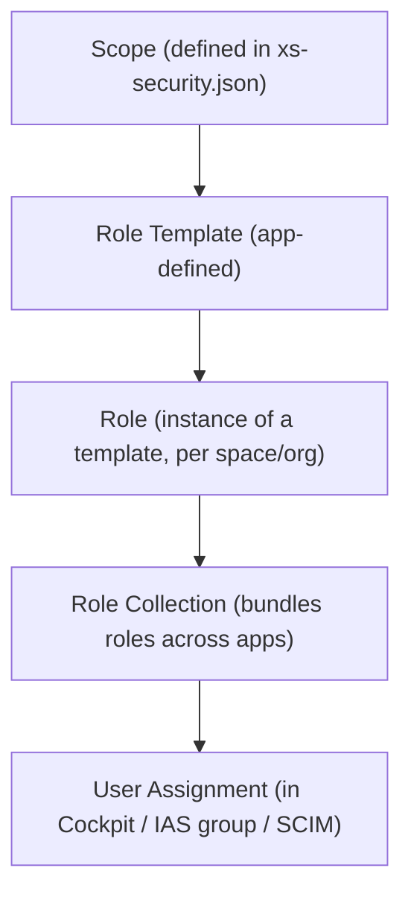

| Layer | Defined By | Analogous ECC Concept |
|---|---|---|
| **Scope** | Developer, in `xs-security.json` of the app | Authorization Object Field |
| **Role Template** | Developer, ships with the application | Authorization Object |
| **Role** | Administrator, instantiates a template for a specific scope/attribute set | Single Role (authorization values filled in) |
| **Role Collection** | Administrator, bundles one or more roles, possibly across multiple applications | Composite Role |
| **User Assignment** | Administrator, via BTP Cockpit, SAML/OIDC group mapping, or SCIM from IPS | User-to-role assignment in SU01/PFCG |

**Key architectural difference from ECC**: BTP authorization checks happen via XSUAA validating the JWT token's scopes on every API call - there is no "buffer" concept like the ECC user authorization buffer. A role collection change takes effect on the **next token issuance**, not instantly for an already-issued token still within its validity window.

**Common exam trap**: "Role Collections are assigned to users, not Roles directly" - Roles are the building block, but end users are always assigned Role Collections (or these are mapped automatically via IAS/IPS group-to-role-collection assignment for federated scenarios).
