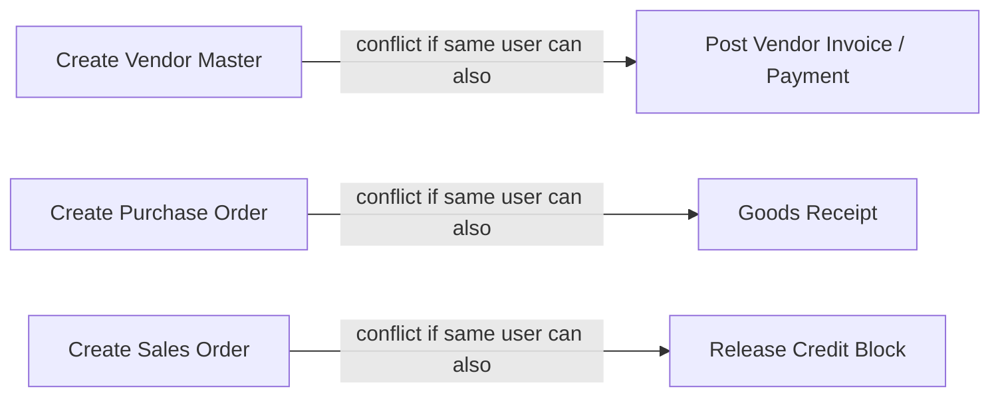

SAP Security exists, ultimately, to satisfy a business requirement that auditors can verify: **the right people have the right access, for the right reasons, with evidence to prove it.** Every framework below asks the same underlying question in different vocabulary.

## Frameworks You Will Be Asked About

| Framework | What It Cares About in SAP | Typical Evidence Requested |
|---|---|---|
| **SOX (Sarbanes-Oxley)** | ITGC over financially-relevant transactions; SoD in FI/CO/MM/SD | User access reviews, SoD risk reports, change management logs |
| **ISO 27001** | Access control policy (A.9), least privilege, periodic review | Access provisioning/de-provisioning procedures, review evidence |
| **NIST 800-53 / CSF** | AC (Access Control) family, PR.AC in CSF | Role-based access control mapping, audit logging configuration |
| **CIS Controls** | Control 5/6 (Account & Access Control Management) | Privileged account inventory, MFA enforcement evidence |
| **Internal Audit** | Company-specific policy adherence | Whatever the internal policy defines - often stricter than external frameworks |

## Segregation of Duties (SoD)

SoD risk exists when a single user (or role combination) can complete both halves of a sensitive business process without independent oversight - the textbook example is **create vendor master + create/post vendor payment**, which enables fictitious vendor fraud.

SAP GRC Access Control's rule set (SAP-delivered plus custom risk IDs) evaluates every role and user against thousands of these permutations. The output is a **risk violation** that must be either remediated (remove the conflicting access) or **mitigated** (documented compensating control, e.g., a monthly reconciliation report reviewed by a manager, formally assigned in GRC as a Mitigating Control).

## Emergency Access / Firefighter

Firefighter (SAP GRC Emergency Access Management) grants temporary elevated access under full logging: every transaction, table change, and even debug/change activity performed during a firefighter session is captured and routed to a **Firefighter Log Review** workflow, typically requiring sign-off within a defined SLA (commonly 5-10 business days). Auditors specifically test: (1) was the firefighter ID's activity actually reviewed, not just logged, and (2) is standing/permanent elevated access being disguised as "always-on firefighter" - a common finding when the review step is a rubber stamp.

## Read Access & Sensitive Data Logging

Read Access Logging (RAL) in S/4HANA and ECC (via table logging / RAL configuration) addresses a blind spot classic authorization concepts miss: **display-only access to sensitive personal or financial data is itself a risk** (e.g., an HR user displaying executive compensation data). RAL lets you log *who viewed* specific fields on specific business objects, not just who changed them.

## What Auditors Actually Sample

1. A list of all users with `SAP_ALL`, `SAP_NEW`, or equivalent broad access - expect zero in production, or a fully documented, time-boxed exception.
2. Evidence of the last periodic User Access Review (UAR) cycle, with sign-offs from business role owners, not just IT.
3. SoD risk analysis output plus mitigation documentation for every "risk accepted" line.
4. Firefighter log review completion rate and turnaround time.
5. Transport approval evidence showing security-relevant changes went through change control, not direct production changes.

Continue into the **SAP GRC, Segregation of Duties & Audit Readiness** chapter for the full internal architecture of GRC Access Control, and into the **Interview Questions** bank filtered to the GRC & Audit category for panel-style audit questions.
